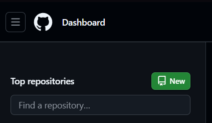
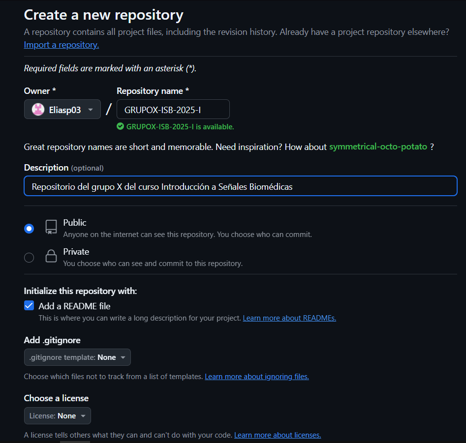
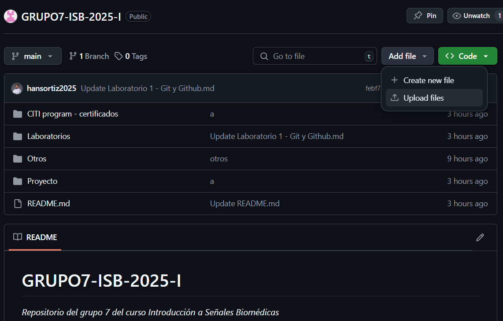
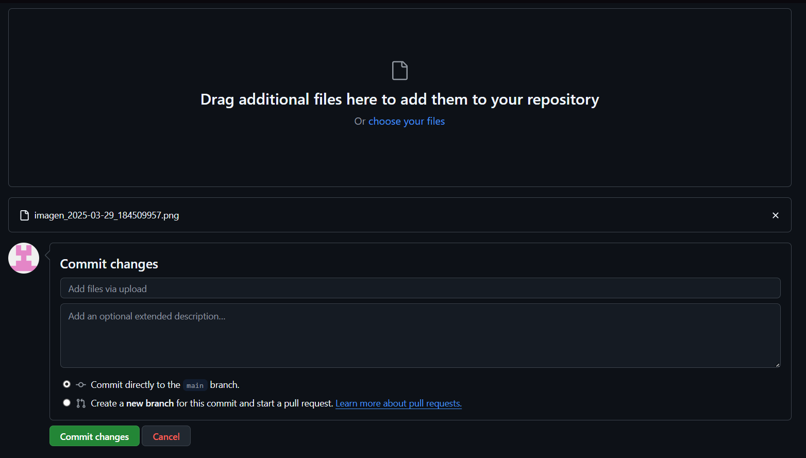
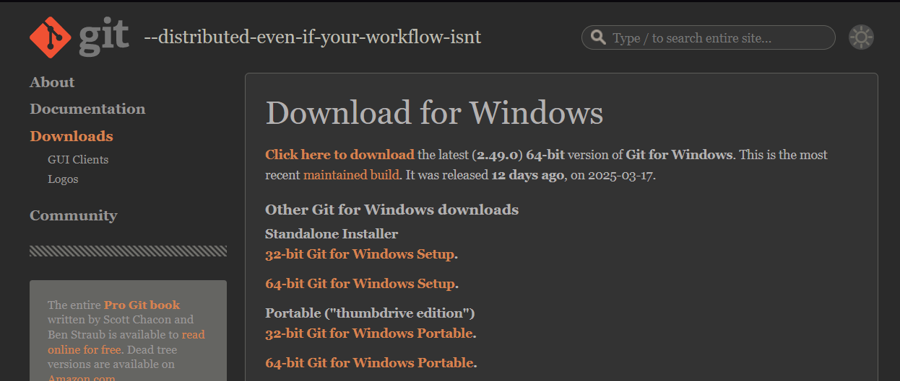

# Laboratorio 1 - Git y Github
Este es un tutorial para usar Git y Github.
Veremos como crear un repositorio, algunas opciones para subir archivos, los comandos más utilizados y algunos consejos.


## Crear un repositorio en GitHub

### Configuración inicial
```bash
# Inicializar repositorio Git
git init

# Configurar usuario (solo primera vez)
git config --global user.name "TuNombre"
git config --global user.email "tu@email.com"
```

1. Entra a la [Página oficial de GitHub](https://github.com) y crear un nuevo repositorio.
 
2. Asigna un nombre, descripción y elige si será público o privado.
3. Opcional: agrega README, .gitignore o licencia.


## Subir archivos a un repositorio en GitHub

Para subir archivos a un repositorio tenemos 2 opciones:
### Opción 1: Subir archivos directamente desde la web
1. Acceder al repositorio y hacer click en 'Add file' para crear un archivo nuevo o subir alguno existente.

2. Elegir los archivos a subir, una descripción y hacer clic en 'Commit changes'


### Opción 2: Subir archivos mediante código con Git Bash
1. Instalar [git](https://git-scm.com/download/win) para Windows.

2. Estos son algunos comandos útiles para subir archivos mediante git bash:
```bash
# Muestra el estado de tu repositorio local.
git status 

#Es importante Siempre hacer git pull antes de git push para actualizar tu repositorio local
git pull origin main

# git add agrega archivos al área de staging.
# Puedes añadir archivos específicos
git add nombre-archivo.txt

# O añadir todo
git add .

# Guardar cambios con un mensaje descriptivo
git commit -m "Mensaje descriptivo"

# Subir cambios
git push origin main
```

Otros comandos utilizados frecuentemente son:

### 🌿 Ramas

```bash
git branch nombre-rama
```
Crea una nueva rama.

```bash
git checkout nombre-rama
```
Cambia de rama.

```bash
git merge nombre-rama
```
Fusiona una rama a la actual.

---

## 🧽 Otros

```bash
git log
```
Muestra el historial de commits.

```bash
git diff
```
Muestra las diferencias entre archivos modificados.

```bash
git rm nombre-archivo
```
Elimina un archivo del repo y lo marca para commit.

---

## 📚 Consejos

- Usa `git status` frecuentemente para estar al tanto del estado del repo.
- Usa `git pull` antes de `git push` para mantenerte actualizado
- Realiza commits pequeños y con mensajes claros.
- Usa ramas para trabajar de forma organizada.

