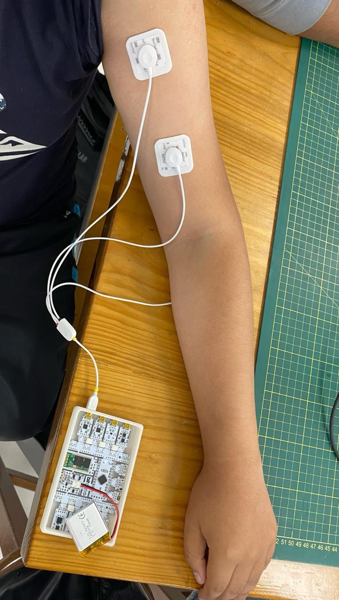

# Laboratorio 3

## Introducción (fundamentos)

## Propósito de la práctica

breve

## Materiales y Métodos

Grabaciones y fotos. descripción

videos Bíceps Braquial

Videos Gastrocnemio

## Resultados y Limitaciones

## Referencias

