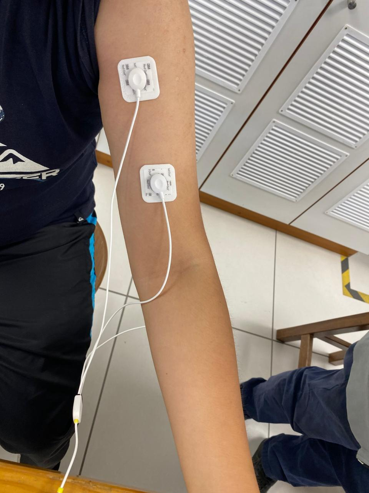

# Laboratorio 3

## Introducción (fundamentos)

## Propósito de la práctica

breve

## Materiales y Métodos

  
 
 

### EMG - Bíceps Braquial

Grabaciones y fotos. descripción

videos Bíceps Braquial

### EMG - Gastrocnemio 

Videos Gastrocnemio

## Resultados y Limitaciones

## Referencias

