# Laboratorio 3 Adquisición de señales EMG

## Introducción

El **BITalino (r)evolution** es un sistema modular desarrollado por *PLUX Wireless Biosignals* que permite la adquisición y análisis de bioseñales en tiempo real. Está diseñado para aplicaciones educativas, de investigación y prototipado en el campo de la Ingeniería Biomédica. Este dispositivo cuenta con sensores integrados para medir señales como electrocardiografía (ECG), electromiografía (EMG), actividad galvánica de la piel (EDA), entre otros, y se comunica de forma inalámbrica a través de Bluetooth [1].

En esta práctica se utilizará el sensor de **electromiografía (EMG)** incluido en el BITalino para medir la actividad eléctrica producida por los músculos esqueléticos. La señal será adquirida usando el software **OpenSignals (r)evolution**, procesada posteriormente con herramientas de análisis digital en Python, y analizada en los dominios del tiempo y la frecuencia para evaluar su comportamiento fisiológico y posibles artefactos. Este tipo de análisis es ampliamente utilizado en áreas como rehabilitación, biomecánica y control de prótesis. [2] [3]


## Propósito de la práctica

- Adquirir señales biomédicas de EMG utilizando el dispositivo **BITalino (r)evolution**.
- Realizar una configuración adecuada del sistema BITalino, incluyendo la conexión por Bluetooth y la colocación correcta de los electrodos.
- Capturar, visualizar y exportar las señales EMG a través del software **OpenSignals (r)evolution** para su posterior análisis en Python.

## Materiales y equipos

- BiTalino (r)evolution kit ( 1 cable de de 2 hilos; 1 cable de 3 hilos, 1 bateria, 1 guía de
inicio rápido, 1 BITalino).
- 3 electrodos de superficie
- Laptop con software Open Signals
- Python 3.12
- Librerías: `neurokit2`, `matplotlib`, `scipy`, `numpy`

En la adquisición de la señal EMG se empleará el cable de tres derivaciones (3-leads), compuesto por un electrodo positivo, uno negativo y uno de referencia.
<div align="center">


</div>

<p align="center"><i>Figura 1. Placa BiTalino (r)evolution</i><p>
  
<div align="center">

 

</div>


<p align="center"><i>Figura 2. Kit bitalino con cables de 2 y 3 derivaciones</i><p>

<div align="center"></div>
<p align="center"><i>Tabla 1. Significado de los colores [<a href="https://support.pluxbiosignals.com/wp-content/uploads/2021/11/electromyography-emg-user-manual.pdf">EMG BiTalino User Manual</a>]</i></p>

## Metodologías
### Configuración de detección EMG
Para la adquisición de señales EMG con el BITalino se emplea una configuración de detección **bipolar**, que consiste en ubicar dos electrodos de detección sobre el músculo objetivo, y un tercer electrodo de referencia sobre una región eléctricamente neutra (como el hueso o una zona alejada del músculo activo).

Esta disposición permite registrar la diferencia de potencial entre los dos puntos activos del músculo (m₁ y m₂), mientras que el ruido eléctrico común a ambos electrodos (n) es cancelado mediante un **amplificador diferencial**. Esta técnica mejora significativamente la relación señal-ruido, haciendo que la señal obtenida sea más representativa de la actividad muscular real. [2]

<div align="center">

</div>

<p align="center"><i> Figura 3: Configuración bipolar de detección EMG. La señal EMG registrada representa la diferencia entre dos electrodos activos ubicados sobre el músculo, mientras que el ruido común se elimina por el amplificador diferencial. [2]</i><p>

### EMG - Bíceps Braquial

El primer músculo analizado fue el bíceps braquial. Previo a la colocación de los electrodos, se realizó una limpieza adecuada de la zona con el fin de asegurar una buena conductividad. Posteriormente, se colocaron los electrodos según lo indicado en la Figura 4: el electrodo positivo se ubicó en la parte proximal del músculo, el negativo en la parte distal, y el electrodo de referencia sobre una zona ósea adyacente, en este caso el codo.

<div align="center">

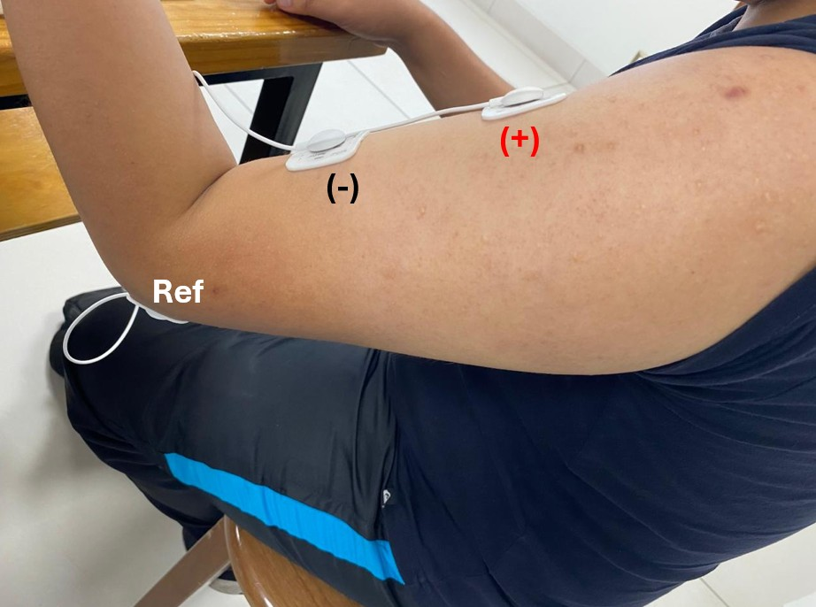</div>
<p align="center"><i>Figura 4. Colocación de electrodos</i><p>

Inicialmente, se realizó una prueba preliminar para verificar que el dispositivo Bitalino y el software OpenSignals registraran adecuadamente la señal del usuario. Una vez confirmado, se procedió a realizar tres pruebas, cada una con tres grabaciones. En la primera prueba, se evaluó la señal EMG del bíceps en reposo; en la segunda prueba, se midió la contracción del bíceps; y, en la tercera prueba, se sometió al usuario a una carga externa para inducir un esfuerzo muscular adicional.

<div align="center">

| **Prueba 1** | **Prueba 2** | **Prueba 3** |
|:------------:|:------------:|:------------:|
|  |  |  |

</div>
<p align="center"><i>Tabla 2. Pruebas realizadas en el bíceps braquial</i><p>

<p align="center"><strong>EMG - Bíceps Braquial</strong></p>

<p align="center">
  <a href="https://www.youtube.com/playlist?list=PL0yjbUQfs0HI3KjGtao96HebQhwQrK4IF">
    
  </a>
</p>

### EMG - Gastrocnemio 

El segundo músculo analizado fue el gastrocnemio. Se repitieron los mismos procedimientos, ubicando el electrodo positivo en la parte proximal del músculo, el negativo en la parte distal y el electrodo de referencia sobre la rodilla.

<div align="center">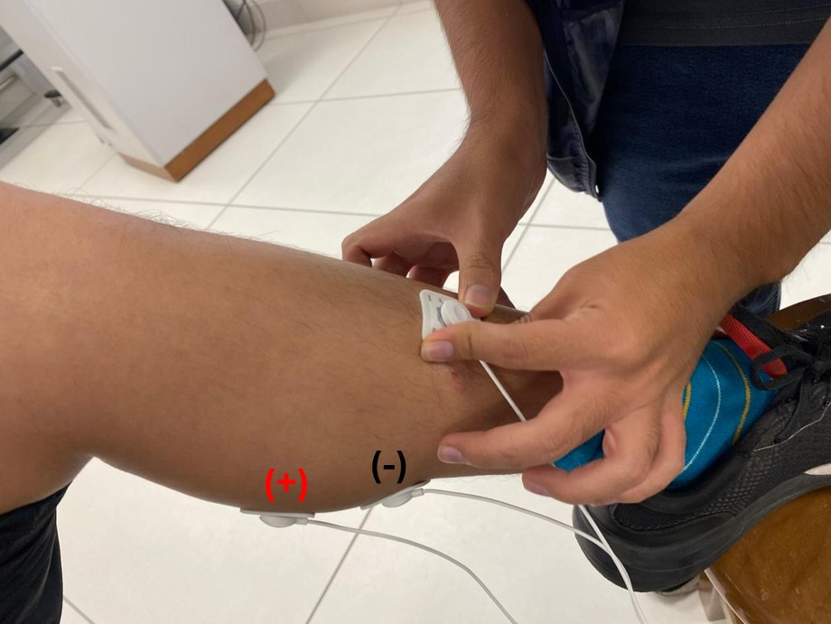
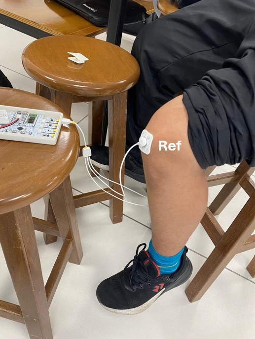</div>
<p align="center"><i>Figura 5. Colocación de electrodos</i><p>

Después de colocar los electrodos, se realizaron tres pruebas. En la primera, se registró la actividad del gastrocnemio en reposo. En la segunda, se captó la actividad muscular durante una ligera contracción del músculo. Finalmente, en la tercera prueba, el usuario se puso de pie e intentó levantarse de puntillas para generar más esfuerzo en el músculo.

<div align="center">

| **Prueba 1** | **Prueba 2** | **Prueba 3** |
|:------------:|:------------:|:------------:|
|  |  |  |

</div>

<p align="center"><i>Tabla 3. Pruebas realizadas en el gastrocnemio</i><p>

<p align="center"><strong>EMG - Gastrocnemio</strong></p>

<p align="center">
  <a href="https://www.youtube.com/playlist?list=PL0yjbUQfs0HJbjQnfOTrr8QcOsbAQNYDM">
    
  </a>
</p>

## Resultados y Limitaciones
Se hace el uso del archivo 'actividad3_v2.py' donde se encuentra lo siguiente: [4] [5]
1. Importar las librerías
```python
import numpy as np
import matplotlib
import matplotlib.pyplot as plt
import neurokit2 as nk
from opensignalsreader import OpenSignalsReader
from scipy.signal import butter, filtfilt
```
2. Leer el archivo .txt de la obtención de la señal del OpenSignals
```python
acq = OpenSignalsReader("LeveBiceps3.txt")
emg_signal = acq.signal([1])  # seleccionamos el canal del sensor
fs = acq.sampling_rate # Obtener frecuencia de muestreo automáticamente del archivo
tiempo = np.linspace(0, len(emg_signal) / fs, len(emg_signal)) # Crear eje de tiempo
```
3. Se grafica la señal cruda del EMG:
```python
plt.figure(figsize=(10, 4))
plt.plot(tiempo, emg_signal, label="EMG cruda")
plt.title("Señal EMG cruda – Bíceps")
plt.xlabel("Tiempo (s)")
plt.ylabel("Amplitud (mV)")
plt.grid(True)
plt.legend()
plt.tight_layout()
plt.savefig("emg_cruda.png")
plt.show()
```
4. Se define un filtro, en este caso pasa banda (20-450 Hz) típico para EMG:
```python
def butter_bandpass(lowcut, highcut, fs, order=4):
    nyq = 0.5 * fs  # Frecuencia de Nyquist
    low = lowcut / nyq
    high = highcut / nyq
    b, a = butter(order, [low, high], btype="band")
    return b, a
def apply_bandpass_filter(data, lowcut, highcut, fs, order=4):
    b, a = butter_bandpass(lowcut, highcut, fs, order=order)
    y = filtfilt(b, a, data)
    return y
emg_filtered = apply_bandpass_filter(emg_signal, lowcut=20, highcut=450, fs=fs) # Aplicar el filtro
```
5. Se grafica la señal EMG filtrada:
```python
plt.figure(figsize=(10, 4))
plt.plot(tiempo, emg_filtered, label="EMG filtrada", color='purple')
plt.title("Señal EMG Filtrada – Pasa banda (20–450 Hz)")
plt.xlabel("Tiempo (s)")
plt.ylabel("Amplitud (mV)")
plt.grid(True)
plt.legend()
plt.tight_layout()
plt.savefig("emg_signal_filtered.png")
plt.show()
```
6. Se realiza la FFT cruda (se encuentra en el archivo 'actividad3_v2.py')
7. Se realiza la FFT de la señal filtrada (se encuentra en el archivo 'actividad3_v2.py')
8. Opcional: Se realiza el procesamiento de la señal con Neurokit2
```python
signals, info = nk.emg_process(emg_signal, sampling_rate=fs, method="threshold", threshold=0.01)
nk.emg_plot(signals,info)
plt.tight_layout()
plt.savefig("emg_procesada.png")
plt.show()
```
Se obtienen las siguientes gráficas:

### EMG - Bíceps Braquial
#### Prueba 1 - En reposo
#####  1. Señal EMG cruda (sin procesar)
Esta es la señal directamente adquirida desde el sensor BITalino utilizando OpenSignals. Se observa ruido de alta frecuencia.

<div align="center">

</div>

####  2. Señal EMG filtrada (pasa banda 20–450 Hz)

Aplicamos un filtro digital Butterworth para limpiar la señal y quedarnos con el rango fisiológico relevante de la EMG.

<div align="center">

</div>

#####  3. Señal EMG procesada con `neurokit2.emg_process()
La función `emg_process()` aplica filtrado, rectificación y normalización. También detecta activaciones musculares (si las hay).

<div align="center">

</div>

#####  4. Espectro de frecuencia – EMG cruda (FFT)
FFT de la señal cruda. Se visualiza la magnitud espectral en decibelios (dB), donde el pico más alto indica la frecuencia dominante.

<div align="center">

</div>


####  5. Espectro de frecuencia – EMG filtrada
FFT de la señal EMG después del filtrado. Deberías ver un espectro más limpio, con menor contenido fuera de banda.

<div align="center">

</div>

#### Prueba 2 - Movimiento ligero
#####  1. Señal EMG cruda (sin procesar)
<div align="center">

</div>

####  2. Señal EMG filtrada (pasa banda 20–450 Hz)
<div align="center">

</div>

#####  3. Señal EMG procesada con `neurokit2.emg_process()
<div align="center">

</div>

#####  4. Espectro de frecuencia – EMG cruda (FFT)
<div align="center">

</div>


####  5. Espectro de frecuencia – EMG filtrada
<div align="center">

</div>


#### Prueba 3 - Movimiento con esfuerzo

#####  1. Señal EMG cruda (sin procesar)
<div align="center">

</div>

####  2. Señal EMG filtrada (pasa banda 20–450 Hz)
<div align="center">

</div>

#####  3. Señal EMG procesada con `neurokit2.emg_process()
<div align="center">

</div>

#####  4. Espectro de frecuencia – EMG cruda (FFT)
<div align="center">

</div>


#####  5. Espectro de frecuencia – EMG filtrada
<div align="center">

</div>


### EMG - Gastrocnemio 
#### Prueba 1 - En reposo
#####  1. Señal EMG cruda (sin procesar)
<div align="center">
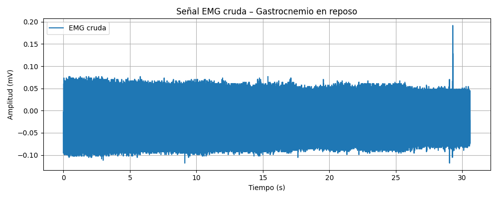
</div>

####  2. Señal EMG filtrada (pasa banda 20–450 Hz)
<div align="center">
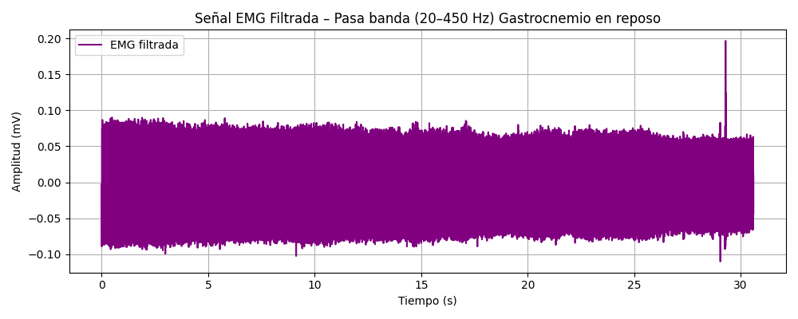
</div>

#####  3. Señal EMG procesada con `neurokit2.emg_process()
<div align="center">
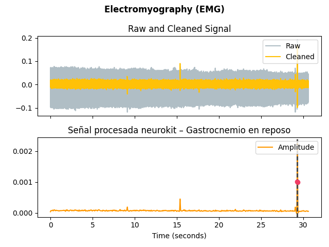
</div>

#####  4. Espectro de frecuencia – EMG cruda (FFT)
<div align="center">
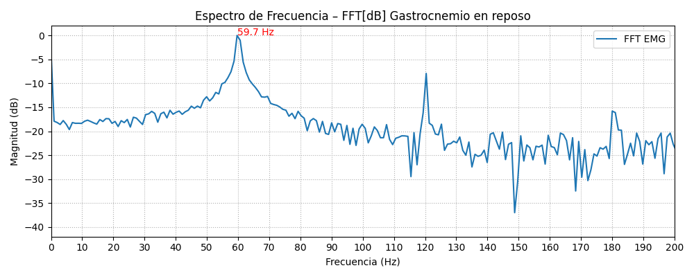
</div>


#####  5. Espectro de frecuencia – EMG filtrada
<div align="center">
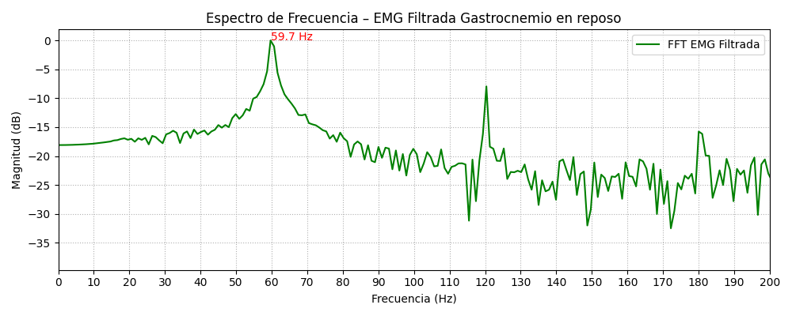
</div>


#### Prueba 2 - Movimiento ligero

#####  1. Señal EMG cruda (sin procesar)
<div align="center">
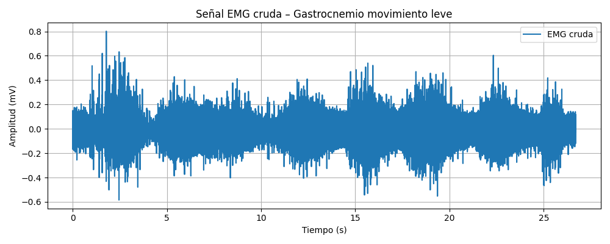
</div>

####  2. Señal EMG filtrada (pasa banda 20–450 Hz)
<div align="center">
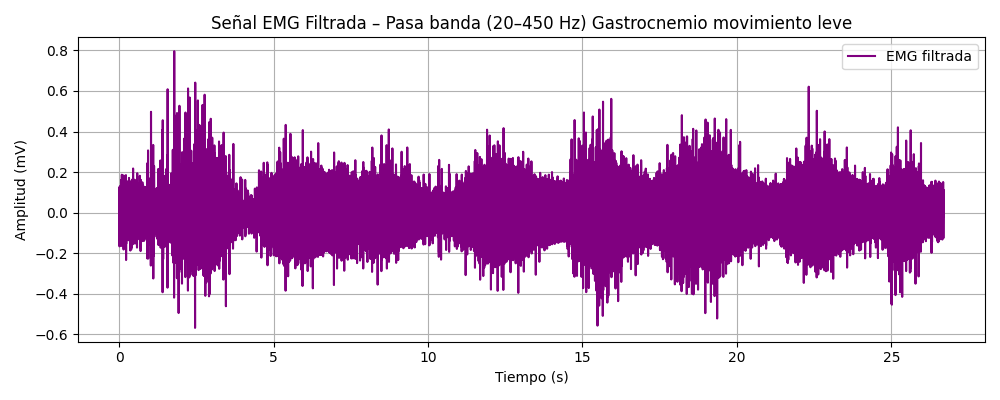
</div>

#####  3. Señal EMG procesada con `neurokit2.emg_process()
<div align="center">
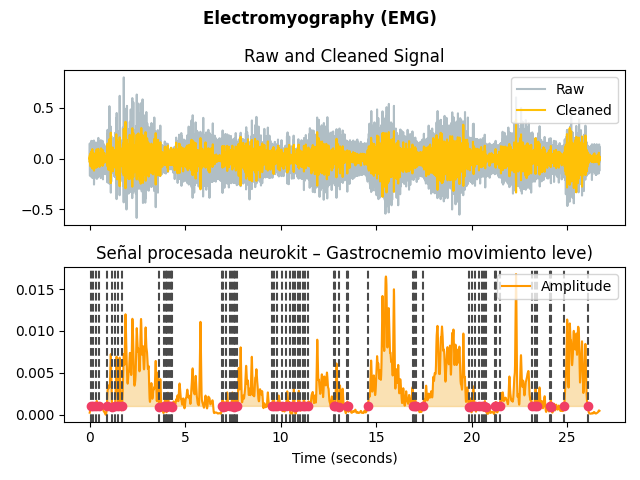
</div>

#####  4. Espectro de frecuencia – EMG cruda (FFT)
<div align="center">
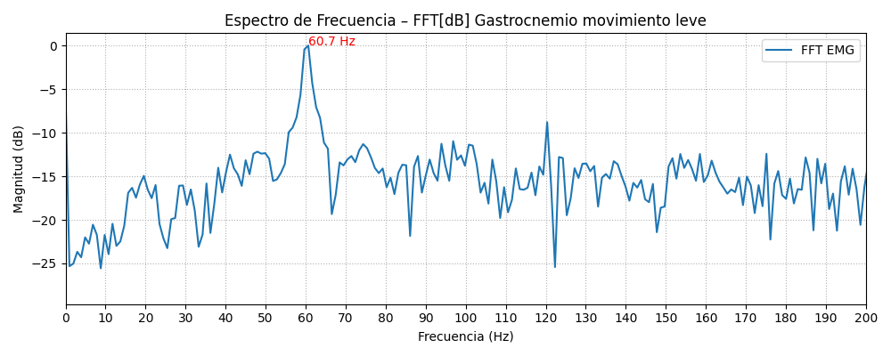
</div>


#####  5. Espectro de frecuencia – EMG filtrada
<div align="center">

</div>


#### Prueba 3 - Movimiento con esfuerzo

#####  1. Señal EMG cruda (sin procesar)
<div align="center">
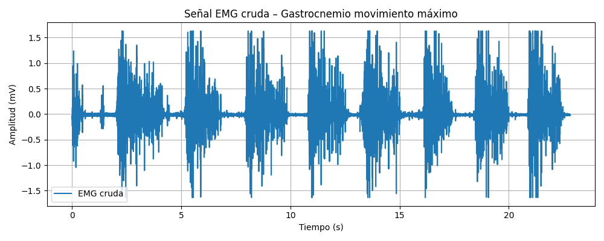
</div>

####  2. Señal EMG filtrada (pasa banda 20–450 Hz)
<div align="center">
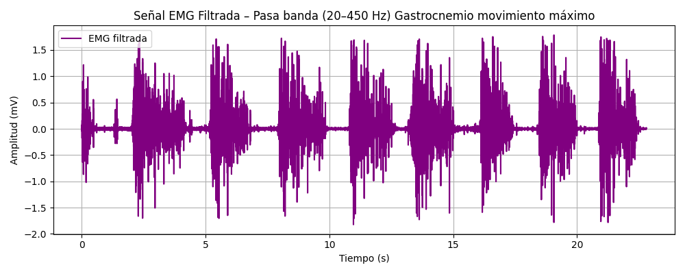
</div>

#####  3. Señal EMG procesada con `neurokit2.emg_process()
<div align="center">
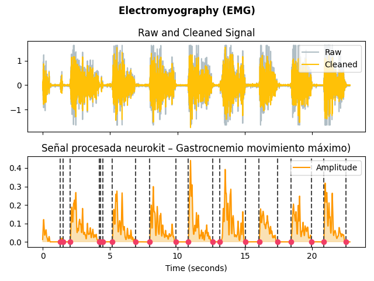
</div>

#####  4. Espectro de frecuencia – EMG cruda (FFT)
<div align="center">
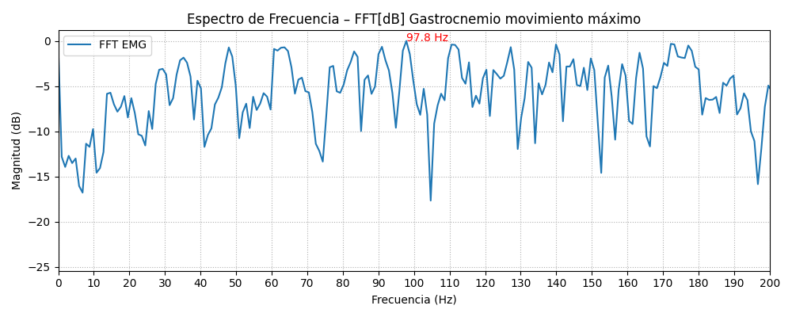
</div>


#####  5. Espectro de frecuencia – EMG filtrada
<div align="center">
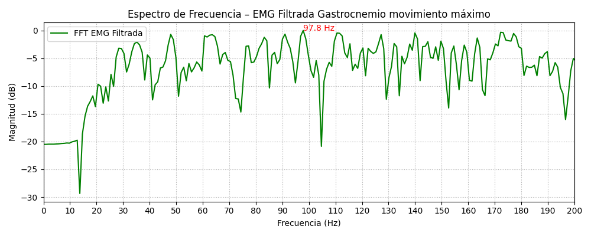
</div>

## Discusión

### Bíceps braquial
En el reposo, se observa que una baja amplitud en la señal (entre -0.5 y 0.5 mV) y constante en el tiempo. Además, se detectan escasas activaciones musculares y ninguna frecuencia sobresaliente.

En el movimiento ligero, se observa un leve aumento tanto en amplitud como en frecuencia de los picos de la señal, esto se debe a un mayor reclutamiento de unidades motoras y un aumento en la frecuencia de disparo de las mismas.

En el movimiento con esfuerzo, se observa un aumento significativo en la amplitud y frecuencia de la señal. Además, se detectan múltiples activaciones musculares y frecuencias más altas, lo cual confirma una activación muscular máxima.

Estos resultados son parecidos a los de un estudio donde se muestra la actividad electromiográfica de superficie (SEMG) del músculo bíceps braquial registrada a distintos niveles de contracción voluntaria, expresados como porcentaje del esfuerzo máximo (40%, 60%, 80% y 100%). [6]
<div align="center">
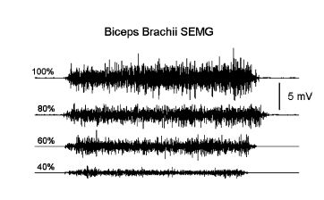
</div>
<p align="center"><i>sEMG del músculo bíceps braquial a distintos niveles de contracción voluntaria [6]</i><p>
  
El valor de frecuencia alrededor de 60 Hz presente en los espectros en frecuencia de todas las señales se debe al ruido de la red eléctrica, para atenuarlo se puede aplicar un filtro Notch.

### Gastrocnemio
De manera similar al músculo bíceps braquial, la señal de sEMG en reposo del músculo gastrocnemio presenta baja amplitud y es constante en el tiempo. Además, se detectan pocas activaciones musculares y ninguna frecuencia sobresaliente.

En el movimiento ligero, se observa un buen aumento tanto en amplitud como en frecuencia de los picos de la señal, esto se debe a un mayor reclutamiento de unidades motoras y un aumento en la frecuencia de disparo de las mismas.

En el movimiento con esfuerzo, se observa un gran significativo en la amplitud y frecuencia en los picos de la señal. Además, se detectan múltiples activaciones musculares y frecuencias más altas, lo cual indica una activación muscular máxima.

Los resultados son similares a un estudio encontrado donde se muestra la señal EMG para distintos músculos, entre ellos el gastrocnemio. Se observa un aumento en la amplitud y frecuencia en la flexión-extensión del pie derecho. [7]
<div align="center">
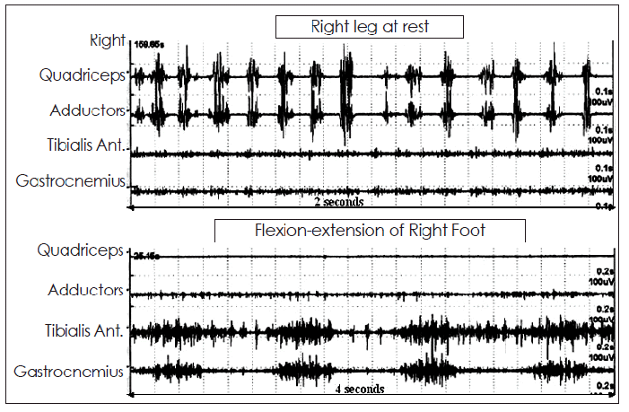
</div>
<p align="center"><i>EMG de distintos músculos de la pierna derecha [7]</i><p>
  
El valor de frecuencia alrededor de 60 Hz presente en los espectros en frecuencia de todas las señales se debe al ruido de la red eléctrica, para atenuarlo se puede aplicar un filtro Notch.

## Limitaciones

Durante la recolección de señales electromiográficas (EMG) del bíceps braquial, uno de los principales desafíos es la colocación del electrodo de referencia en la zona del codo, ya que, al estar asociada a una articulación móvil, esta área puede generar artefactos debido al movimiento, lo que afecta la calidad de la señal [8]. Además, cuando los electrodos activos no se colocan correctamente en el vientre muscular o no se alinean adecuadamente con las fibras del músculo, se pierde calidad en el registro y se incrementa la captación de señales de músculos adyacentes, como el braquial o el tríceps [9]. Para mejorar la señal, se recomienda posicionar los electrodos activos sobre la porción central del músculo, manteniendo una separación de aproximadamente 2 cm y alineados con las fibras musculares [8]. Asimismo, se sugiere ubicar el electrodo de referencia en una zona ósea más estable, como el acromion o el tronco, para reducir los artefactos de movimiento y mejorar la confiabilidad de los datos obtenidos [9].

En cuanto al gastrocnemio medial, las limitaciones están relacionadas con el posicionamiento del electrodo de referencia cerca de la tibia, ya que esta área, aunque se trata de una superficie ósea, puede generar interferencias si no está bien fijada o si se encuentra demasiado cerca de los electrodos activos [10]. Además, colocar los electrodos activos fuera del centro del vientre muscular, cerca del tendón de Aquiles o en zonas con tejido adiposo, puede disminuir la intensidad de la señal y aumentar la captación de actividad de músculos cercanos, como el sóleo [10]. Para optimizar el registro, es recomendable situar los electrodos activos en la parte más prominente del músculo, alineados con las fibras musculares, en el tercio superior de la pierna [8]. También se debe preparar adecuadamente la piel mediante limpieza y rasurado para reducir la impedancia [9]. Además, es útil reubicar el electrodo de referencia en una zona más estable, como la espina ilíaca anterosuperior, para minimizar el ruido y mejorar la estabilidad de la señal [10].

## Referencias
[1] PLUX Wireless Biosignals, "BITalino (r)evolution Board Kit," [Online]. Available: https://www.pluxbiosignals.com.

[2] De Luca, C.J. Electromyography.  Encyclopedia of Medical Devices and Instrumentation, (John G. Webster, Ed.), [Online]. Available: [https://www.delsys.com/knowledge-center/what-is-emg/.](https://delsys.com/downloads/TUTORIAL/emg-encyclopedia-of-medical-devices-and-instrumentation.pdf)

[3] J. Merletti and D. Farina, *Surface Electromyography: Physiology, Engineering, and Applications*, Wiley-IEEE Press, 2016. [Online]. Available: [https://www.wiley.com/en-us/Surface+Electromyography%3A+Physiology%2C+Engineering%2C+and+Applications-p-9781119082934.](https://onlinelibrary.wiley.com/doi/book/10.1002/9781119082934)

[4] P. Gomes, OpenSignalsReader, GitHub repository, 2023. [Online]. Available: https://github.com/PGomes92/opensignalsreader.

[5] T. Makowski and J. Kosinski, “emg_process() - NeuroKit2 EMG Processing Function,” NeuroKit Documentation, 2020. [Online]. Available: https://neuropsychology.github.io/NeuroKit/functions/emg.html.

[6] Gabriel DA, Kamen G. Experimental and modeling investigation of spectral compression of biceps brachii SEMG activity with increasing force levels. J Electromyogr Kinesiol [Internet]. 2009;19(3):437–48. Disponible en: http://dx.doi.org/10.1016/j.jelekin.2007.10.009

[7] Pal PK. Electrophysiologic evaluation of psychogenic movement disorders. J Mov Disord [Internet]. 2011;4(1):21–32. Disponible en: http://dx.doi.org/10.14802/jmd.11004

[8] Merletti R, Cerone GL. Tutorial. Surface EMG detection, conditioning and pre-processing: Best practices. J Electromyogr Kinesiol [Internet]. 2020;54(102440):102440. Disponible en: https://pubmed.ncbi.nlm.nih.gov/32763743/ 

[9] Manca A, Cereatti A, Bar-On L, Botter A, Della Croce U, Knaflitz M, et al. A survey on the use and barriers of surface electromyography in neurorehabilitation. Front Neurol [Internet]. 2020;11:573616. Disponible en:[ https://pubmed.ncbi.nlm.nih.gov/33123079/](https://www.frontiersin.org/journals/neurology/articles/10.3389/fneur.2020.573616/full)

[10] Douglas F, Pei M, Kuo C. Characterizing the effect of electrode shift & sensor reapplication on common sEMG features in lower limb muscles [Internet]. arXiv [eess.SP]. 2024. Disponible en: http://arxiv.org/abs/2410.16262 


