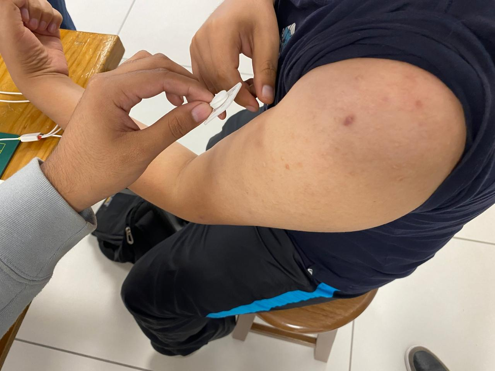
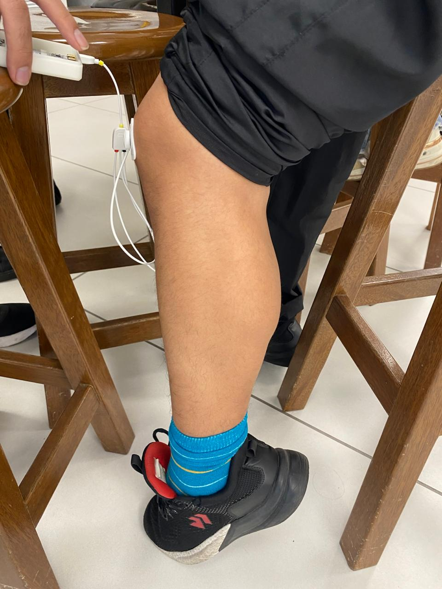

# Laboratorio 3

## Introducción (fundamentos)

El BITalino es un sistema desarrollado por PLUX Biosignals para la adquisición de bioseñales con fines educativos y de investigación. En esta actividad se utilizará su sensor de electromiografía (EMG) para medir de forma no invasiva la actividad eléctrica muscular. La señal será registrada con el software OpenSignals y luego analizada usando Python.

<i>Figura 2. Placa BiTalino (r)evolution</i>

## Propósito de la práctica

- Adquirir señales biomédicas de EMG y ECG.
- Hacer una correcta configuración de BiTalino.
- Extraer la información de las señales EMG del software OpenSignals (r)evolution

## Materiales

- BiTalino (r)evolution kit
- 3 electrodos de superficie
- Laptop con software Open Signals
- Python 3.12
- Librerías: `neurokit2`, `matplotlib`, `scipy`, `numpy`

Para la adquisición de la sñal EMG se empleará el cable de tres derivaciones (3-leads), compuesto por un electrodo positivo, uno negativo y uno de referencia.

 

<i>Figura 1. Kit bitalino con cables de 2 y 3 derivaciones</i>

<i>Tabla 1. Significado de los colores [<a href="https://support.pluxbiosignals.com/wp-content/uploads/2021/11/electromyography-emg-user-manual.pdf">EMG BiTalino User Manual</a>]</i>

## Métodos  
### EMG - Bíceps Braquial

...

<i>Figura 3. Colocación de electrodos</i>

| **Prueba 1** | **Prueba 2** | **Prueba 3** |
|:------------:|:------------:|:------------:|
|  |  |  |

videos Bíceps Braquial

### EMG - Gastrocnemio 

...

<i>Figura 4. Colocación de electrodos</i>

| **Prueba 1** | **Prueba 2** | **Prueba 3** |
|:------------:|:------------:|:------------:|
|  |  |  |

Videos Gastrocnemio

## Resultados y Limitaciones

## Referencias

