# Laboratorio 05 - Uso de BiTalino para EEG
## Contenido
1. [Introducción](#id1)
2. [Propósito de la práctica](#id2)
3. [Materiales y equipos](#id3)
4. [Metodología y resultados](#id4)
5. [Discusiones y limitaciones](#id5)
6. [Conclusiones](#id6)

## 1. Introducción 

     
El electroencefalograma (EEG) es una técnica neurofisiológica clave para evaluar la actividad eléctrica cerebral, empleada en el diagnóstico de trastornos como la epilepsia, lesiones cerebrales y enfermedades neurodegenerativas como el Alzheimer [1]. Su funcionamiento se basa en la colocación meticulosa de electrodos en el cuero cabelludo, guiada por referencias anatómicas internacionales como el nasion (entre la frente y la nariz) y el inion (en la región occipital), que permiten ubicar áreas específicas del cerebro mediante códigos alfanuméricos (ejemplo: Fp para frontopolar, T3 para temporal izquierdo) [2]. Estos electrodos captan la suma de potenciales postsinápticos excitatorios (EPSP) e inhibitorios (IPSP) generados por la corteza cerebral, donde los primeros producen deflexiones negativas (ondas ascendentes en el EEG) y los segundos, positivas (ondas descendentes), reflejando así la dinámica neuronal subyacente [3].
  
    

  
La interpretación clínica del EEG no solo depende de identificar anomalías en las ondas básicas, como los picos rápidos en epilepsia o las lentificaciones por lesiones, sino también de técnicas de montaje (bipolar o referencial) que ayudan a localizar el origen de la actividad eléctrica mediante fenómenos como las reversiones de fase [2]. Además, el EEG tiene aplicaciones críticas en contextos como el monitoreo intraoperatorio de flujo sanguíneo cerebral o la evaluación de daño neurológico en pacientes en coma, donde su precisión se ve influenciada por factores como la colocación correcta de electrodos y la ausencia de interferencias (ejemplo: cabello graso o medicamentos sedantes) [1].
  
  

 
La interdependencia entre principios técnicos, bases biológicas y aplicaciones clínicas consolida al EEG como una herramienta versátil e indispensable en la neurología moderna, capaz de adaptarse desde estudios de sueño hasta emergencias médicas [1] [2] [3]. 

## 2. Propósito de la práctica 

   
Esta práctica busca configurar el dispositivo BITalino (r)evolution Board Kit BLE/BT para registrar señales EEG, ubicando electrodos en las posiciones Fp1, Fp2 y O2 del sistema 10-20. Se registrarán segmentos de actividad cerebral en tres condiciones: estado basal (ojos abiertos/cerrados), durante una tarea cognitiva y con artefactos controlados. Los datos se procesarán con un filtro band-pass (0.8–48 Hz) para identificar los ritmos δ, θ, α y β, y posteriormente se exportarán para generar un informe breve con resultados cuantitativos.

## 3. Materiales y equipos 
| Equipo/Material     |Cantidad   |
|-----------   |:------------:
|BITalino (r)evolution Board Kit BLE/BT[4]  | 1          |
|Laptop con Bluetooth 4.0+           | 1          |
|Electrodos ECG   | 3          |
|Software OpenSignals (r)evolution | 1          |

## 3. Metodología y resultados 

   
  Para empezar con la lectura de señales, se limpian las zonas Fp1, Fp2 y mastoide derecha (usada de referencia), y se conectan los electrodos. También se verifica en OpenSignals que la impedancia sea inferior a 20 kΩ.
  

   
Se adquirieron señales EEG reales usando el sistema BITalino mediante el siguiente procedimiento:
  
- Minutos 0-1 (Basal 1): El participante mantiene los ojos abiertos, fijando la mirada en un punto estático frente a sí, sin realizar movimientos corporales.

- Minutos 1-2 (Basal 2): El participante cierra los ojos y permanece en reposo, evitando movimientos oculares o musculares voluntarios.

- Minutos 2-4 (Tarea cognitiva): Se solicita al participante realizar cálculos mentales, como restar 7 sucesivamente desde 100 en silencio.

- Minutos 4-6 (Artefactos): Se inducen artefactos controlados: parpadeo cada 2 segundos y movimientos de masticación simulada.

- Minutos 6-12 (Libre): El participante realiza actividades diseñadas por el grupo, incluyendo la lectura de un texto agradable y la escucha de un relato de terror.

 

<i>Figura 1. Procedimiento experimental</i>

<strong>Adquisición de la señal</strong>

  

## 4. Resultados

### Detalles del procesamiento 

- **Filtro** aplicado: pasabanda de 1–40 Hz, Butterworth de orden 5.
- **Transformada rápida de Fourier (FFT)** con 1024 puntos por defecto en matplotlib.pyplot.magnitude_spectrum.
- **Software usado:** Python 3.12, NeuroKit2 para filtrado, matplotlib.pyplot.magnitude_spectrum para espectro en frecuencia.

### 4.1 Basal 1 (Mirada en un punto fijo) 

#### 4.1.1 Comparación por segmentos 
Comparamos las señales obtenidas durante la recolección de datos con OpenSignals con el ploteo posterior.
| OpenSignals| Ploteo |
|:---------|:-----------------|
|  |  |
|  | 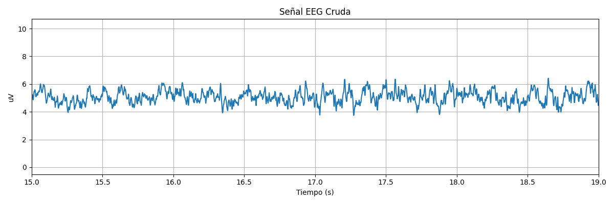 |
|  |  |

#### 4.1.2 Gráficas 

| Señal| Gráfica generada |
|:---------|:-----------------|
| Señal Raw |  |
| Señal filtrada | 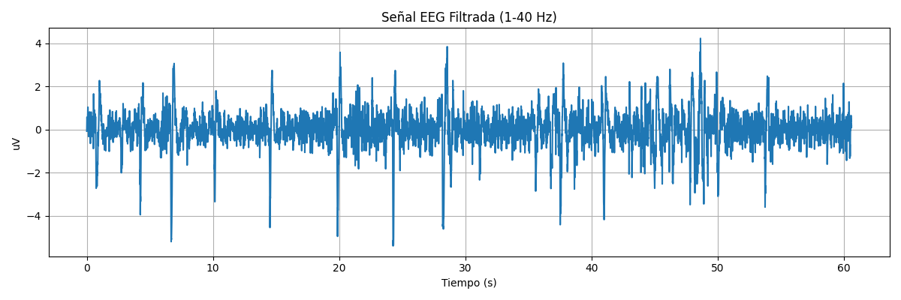 |
| PSD welch |  |
| FFT |  |
| FFT filtrada| 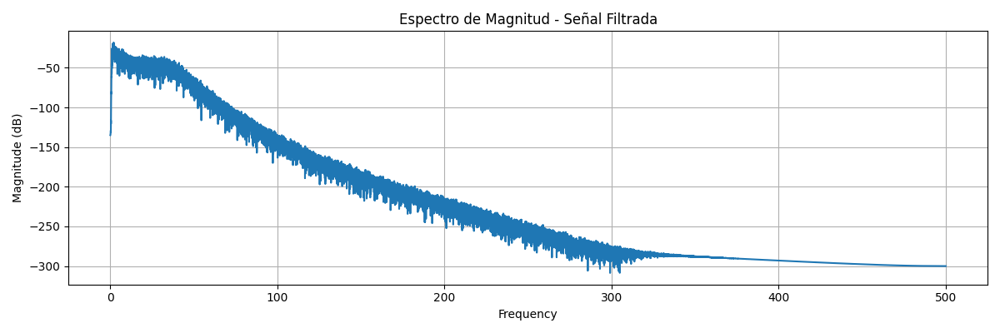 |

### 4.2 Basal 2 (Ojos cerrados) 

#### 4.2.1 Comparación por segmentos 
Comparamos las señales obtenidas durante la recolección de datos con OpenSignals con el ploteo posterior.
| OpenSignals| Ploteo |
|:---------|:-----------------|
|  |  |
|  |  |
|  |  |

#### 4.2.2 Gráficas 

| Señal| Gráfica generada |
|:---------|:-----------------|
| Señal Raw | 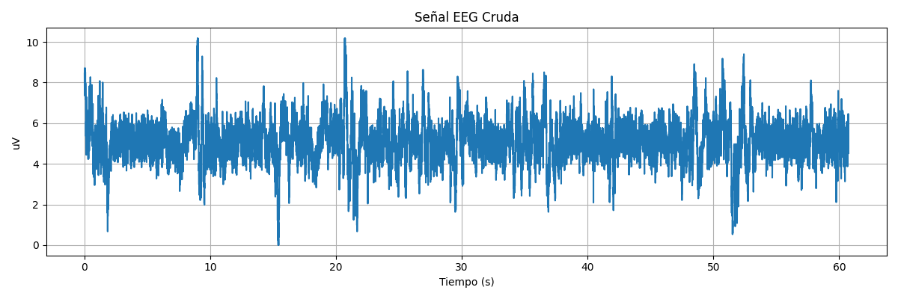 |
| Señal filtrada | 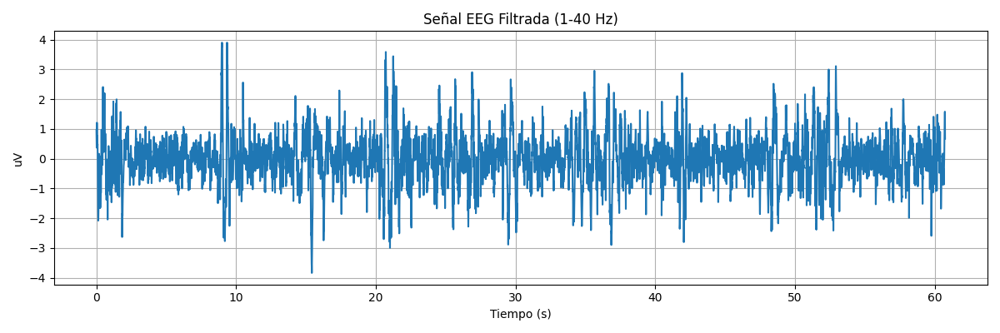 |
| FFT |  |
| FFT filtrada|  |

### 4.3 Artefactos (Parpadeando y masticando) 

#### 4.3.1 Comparación por segmentos 
Comparamos las señales obtenidas durante la recolección de datos con OpenSignals con el ploteo posterior.
| OpenSignals| Ploteo |
|:---------|:-----------------|
|  | 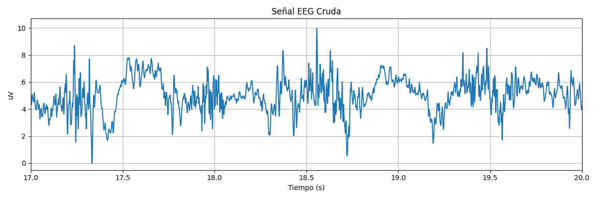 |
| 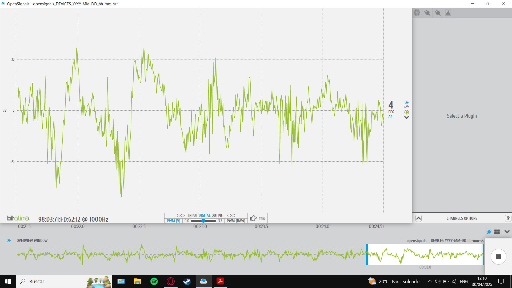 |  |
|  | 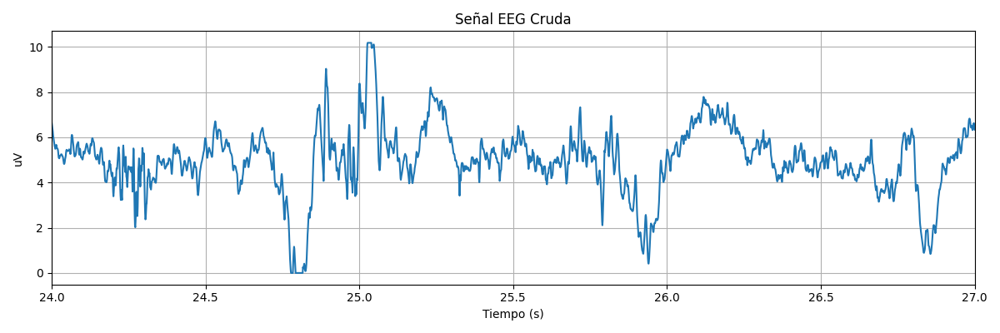 |

#### 4.3.2 Gráficas 

| Señal| Gráfica generada |
|:---------|:-----------------|
| Señal Raw | 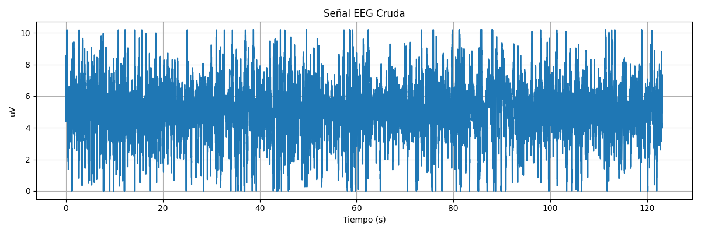 |
| Señal filtrada |  |
| FFT |  |
| FFT filtrada|  |

### 4.4 Tarea cognitiva (Operaciones matemáticas) 

#### 4.4.1 Comparación por segmentos 
Comparamos las señales obtenidas durante la recolección de datos con OpenSignals con el ploteo posterior.
| OpenSignals| Ploteo |
|:---------|:-----------------|
|  | 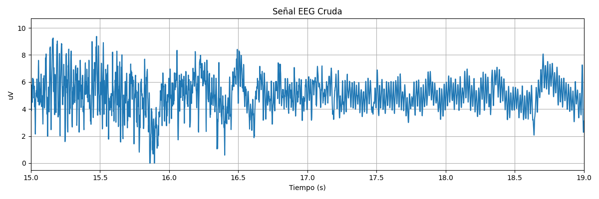 |
|  |  |
| 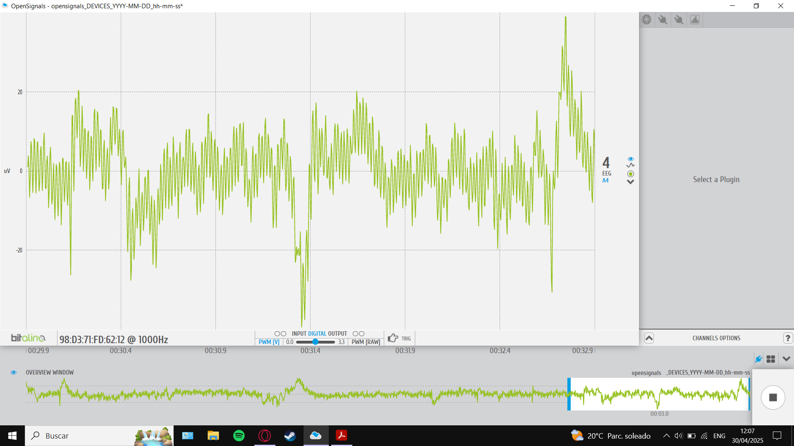 | 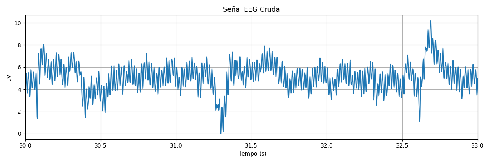 |

#### 4.4.2 Gráficas 

| Señal| Gráfica generada |
|:---------|:-----------------|
| Señal Raw | 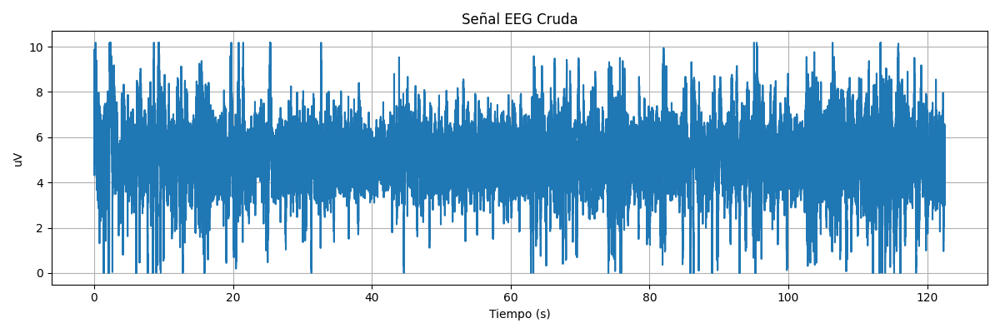 |
| Señal filtrada | 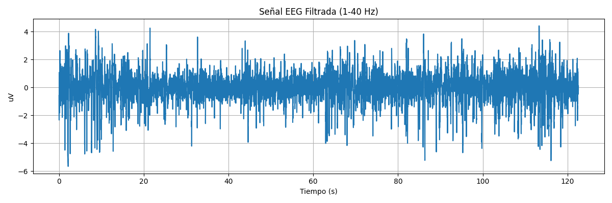 |
| FFT | 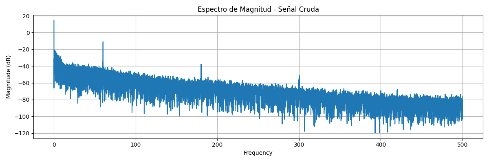 |
| FFT filtrada|  |

### 4.5 Lectura 

#### 4.5.1 Comparación por segmentos 
Comparamos las señales obtenidas durante la recolección de datos con OpenSignals con el ploteo posterior.
| OpenSignals| Ploteo |
|:---------|:-----------------|
|  |  |
|  |  |
| 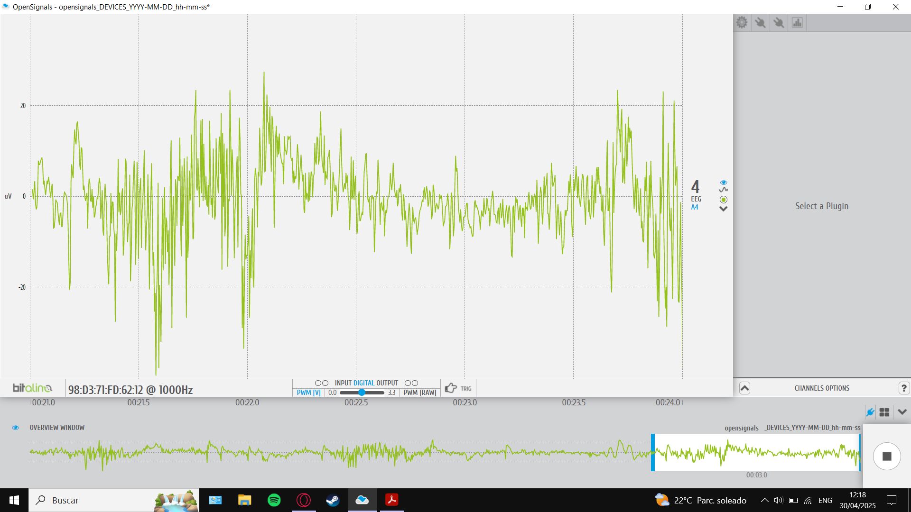 |  |

#### 4.5.2 Gráficas 

| Señal| Gráfica generada |
|:---------|:-----------------|
| Señal Raw | 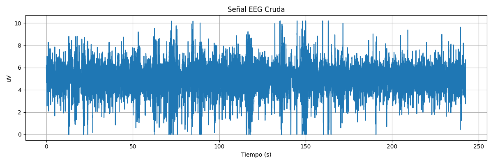 |
| Señal filtrada | 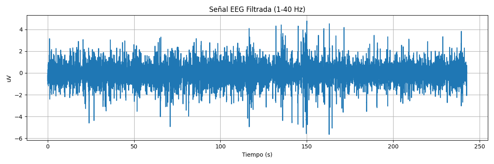 |
| FFT |  |
| FFT filtrada|  |

### 4.6 Visualizacion de videos 

#### 4.6.1 Comparación por segmentos 
Comparamos las señales obtenidas durante la recolección de datos con OpenSignals con el ploteo posterior.
| OpenSignals| Ploteo |
|:---------|:-----------------|
|  |  |
|  |  |
|  |  |

#### 4.6.2 Gráficas 

| Señal| Gráfica generada |
|:---------|:-----------------|
| Señal Raw | 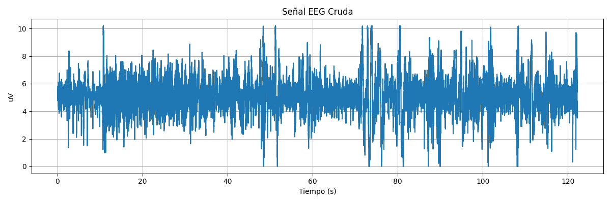 |
| Señal filtrada | 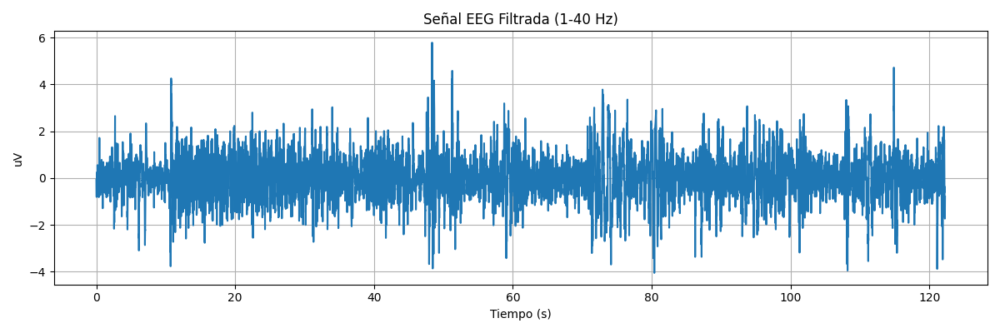 |
| FFT |  |
| FFT filtrada|  |

## 5. Discusiones y limitaciones 

## 6. Conclusiones 

## Bibliografía
[1] “Electroencephalogram (EEG)”. Johns Hopkins Medicine. [En línea]. Disponible: https://www.hopkinsmedicine.org/health/treatment-tests-and-therapies/electroencephalogram-eeg

[2] “How to Read an EEG”. Epilepsy Foundation. [En línea]. Disponible: https://www.epilepsy.com/diagnosis/eeg/how-read

[3] “EEG (Electroencephalography): The Complete Pocket Guide - iMotions”. iMotions. Accedido el 3 de mayo de 2025. [En línea]. Disponible: https://imotions.com/blog/learning/best-practice/eeg/ 

[4] “BITalino”. PLUX Biosignals. Accedido el 26 de abril de 2025. [En línea]. Disponible: https://www.pluxbiosignals.com/collections/bitalino?srsltid=AfmBOopxPuL4rizGon-RlE3KPmQOCbfBI1UOzH1FhKijinshBj1K7VCj

[5] 
[6] 

[7] 

[8] 

[9] 

[10] 
[11} 
[12] 
