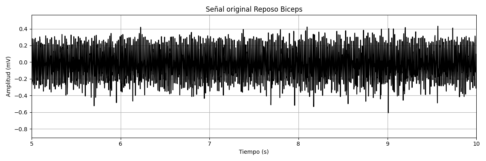
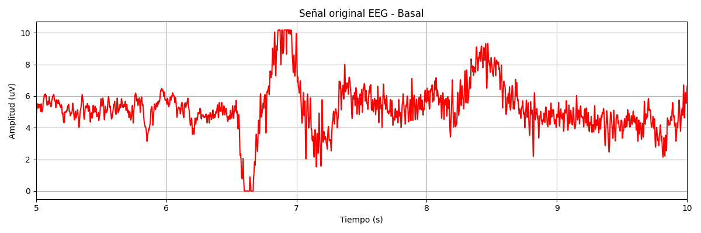

# Laboratorio 07 - Transformada Wavelet
## Contenido
1. [Introducción](#id1)
2. [Materiales y equipos](#id2)
3. [Propósito de la práctica](#id3)
4. [Metodología](#id4) 
  4.1. [Señal ECG](#id5) 
  4.2. [Señal EMG](#id6) 
  4.3. [Señal EEG](#id7) 
5. [Resultados](#id8) 
  5.1. [Señal ECG](#id9) 
  5.2. [Señal EMG](#id10) 
  5.3. [Señal EEG](#id11) 
6. [Discusiones](#id12)
7. [Referencias](#id13)

## 1. Introducción 

En la ingeniería biomédica, el análisis de señales como el electrocardiograma (ECG), electromiograma (EMG) y electroencefalograma (EEG) es esencial para el diagnóstico clínico y la investigación. Estas señales, al ser inherentemente no estacionarias, suelen presentar ruido y artefactos que dificultan su interpretación directa [1][2]. Ante esta complejidad, la Transformada Wavelet ha emergido como una herramienta matemática eficaz para el procesamiento de señales biomédicas, ya que permite una descomposición multiresolución que conserva simultáneamente la información temporal y frecuencial de la señal [3][4].

A diferencia de la Transformada de Fourier, que ofrece una visión global de las frecuencias sin indicar su localización temporal, la Transformada Wavelet adapta su resolución en función de la escala: proporciona alta resolución temporal para frecuencias altas y alta resolución en frecuencia para componentes de baja frecuencia [4][5]. Esta propiedad la convierte en una técnica ideal para la detección de eventos transitorios y patrones clínicos relevantes, como los complejos QRS en señales ECG, los artefactos de movimiento en EMG o las ondas anómalas en EEG asociadas con trastornos neurológicos [3][4][6].

La transformada wavelet puede implementarse principalmente de dos formas. La Transformada Wavelet Continua (CWT) realiza un análisis exhaustivo utilizando una variedad continua de escalas y posiciones, lo que proporciona alta precisión pero con una elevada redundancia y costo computacional [7]. Por otro lado, la Transformada Wavelet Discreta (DWT) emplea escalas y traslaciones discretas, permitiendo una representación más eficiente y compatible con sistemas digitales [8]. Esta última descompone la señal mediante filtros pasaaltos y pasabajos, separando sus componentes de alta y baja frecuencia y generando una estructura jerárquica en distintos niveles de resolución [1]. Además, la elección de la familia de wavelets es crucial según la naturaleza de la señal y el objetivo del análisis. Existen diversas opciones como Haar, Daubechies, Symlets, Coiflets y Morlet, cada una con características específicas en términos de suavidad, simetría y soporte compacto, que influyen en la calidad del procesamiento y la fidelidad de la reconstrucción [8].

## 2. Materiales y equipos 

|  **Modelo**  | **Descripción** | **Cantidad** | **Imagen** |
|:------------:|:---------------:|:------------:|:----------:|
|-|**Laptop o PC**: Laptop equipada con el programa Python 3.12 y las librerías neurokit2, matplotlib,scipy,numpy para poder implementar ahí el código y realizar los respectivos filtrados|1|<image width="300" height="100" src="https://eu-images.contentstack.com/v3/assets/blt07f68461ccd75245/blte12a184fec085629/6706c29adabd3cb01a7aff9c/Python-logo-1716x965_-_2024-10-09.jpg?width=1280&auto=webp&quality=95&format=jpg&disable=upscale">|

## 3. Propósito de la práctica 
Implementar y comparar el filtrado wavelet para reducir el ruido por artefactos producidos de las señales ECG, EMG y EEG.

## 4. Metodología 

### 4.1. Señal ECG 
### 4.2. Señal EMG 
### 4.3. Señal EEG 
El filtro utilizado, a partir de la literatura de referencia, para la eliminación de ruido en la señal es un filtro DWT tipo Biorthogonal 2.6, debido a su alta simetría, capacidad de separar eficazmente los componentes de frecuencia baja y alta y reconstrucción de la señal original y un nivel de 5. Los coeficientes de aproximación fueron A5 y de detalle D1, D2, D3, D4 y D5. [x3]

	
|  **Función Wavelet**  | **Nivel** | **Umbral** | **Frecuencia** | **Coeficiente de aproximación** | **Coeficientes de detalle** | 
|:------------:|:---------------:|:------------:|:------------:|:------------:|:------------:|
|bior2.6 (Biorthogonal 2.6)|5|16|1000 Hz|A5| D1, D2, D3, D4, D5|

  
## 5. Resultados 

### 5.1. Señal ECG 

| 1era derivada | Señal Cruda | Filtro DWT |
|:-------------:|:------------:|:-------------------:|
| Basal         |  |  |
| Respiración   |  |  |
| Post-Ejercicio|  |  | 

| 2da derivada | Señal Cruda | Filtro DWT |
|:-------------:|:------------:|:-------------------:|
| Basal         |  |  |
| Respiración   |  |  |
| Post-Ejercicio|  |  | 

| 3era derivada | Señal Cruda | Filtro DWT |
|:-------------:|:------------:|:-------------------:|
| Basal         |  |  |
| Respiración   |  |  |
| Post-Ejercicio|  |  | 

### 5.2. Señal EMG 

| Campo | Señal Cruda | Filtro DWT |
|:-------------:|:------------:|:-------------------:|
| Reposo Biceps        |  |  |
| Leve Biceps |  |  |
| Maximo Biceps|  |  |

## 5.3. Señal EEG 

| Campo | Señal Cruda | Filtro DWT |
|:-------------:|:------------:|:-------------------:|
| Basal |  |  |
| Tarea cognitiva |  |  |
| Lectura|  |  |

## 6. Discusiones y Conclusiones 

## 7. Referencias 

[1] S. Kouro and R. Musalem, “Tutorial introductorio a la Teoría de Wavelet.” Disponble: http://www2.elo.utfsm.cl/~elo377/documentos/Wavelet.pdf.

[2] G. Antonio and L. Paredes, “Reconocimiento de patrones en electroforesis capilar utilizando análisis multiresolucional y programación dinámica / Gerardo Ceballos,” 2024. Disponible: https://www.researchgate.net/publication/44720047_Reconocimiento_de_patrones_en_electroforesis_capilar_utilizando_analisis_multiresolucional_y_programacion_dinamica_Gerardo_Ceballos

[3] T. Sharma and K. K. Sharma, "QRS Complex Detection in ECG Signals Using the Synchrosqueezed Wavelet Transform," IETE Journal of Research, vol. 62, no. 6, pp. 885-892, Nov.-Dec. 2016, doi: 10.1080/03772063.2016.1221744.

[4] P. Zandiyeh, L. R. Parola, B. C. Fleming, and J. E. Beveridge, "Wavelet analysis reveals differential lower limb muscle activity patterns long after anterior cruciate ligament reconstruction," Journal of Biomechanics, vol. 133, p. 110957, 2022, doi: 10.1016/j.jbiomech.2022.110957.

[5] N. N. B and D. Marcela, “El uso de la transformada wavelet discreta en la reconstrucción de señales senosoidales.,” Scientia et Technica, vol. 1, no. 38, pp. 381–386, 2024‌‌.

[6] S. Mallat, "Chapter 3 - Discrete Revolution," in A Wavelet Tour of Signal Processing, 3rd ed., San Diego, CA, USA: Academic Press, 2009, pp. 59-88.

[7] R. González G., "Capítulo 3: Revisión de la Teoría de Wavelets," Universidad de las Américas Puebla, Puebla, México. Disponible: https://catarina.udlap.mx/u_dl_a/tales/documentos/mel/gonzalez_g_ra/capitulo3.pdf.

[8]  E. Pinto Moreno, "Familias de Wavelets," Universidad Carlos III de Madrid, Madrid, España. Disponible: https://e-archivo.uc3m.es/bitstream/10016/16582/1/PFC_Elena_Pinto_Moreno_Anexos.pdf. 

[x3] A. W. Pise and P. P. Rege, "Comparative analysis of various filtering techniques for denoising EEG signals," in 2021 6th International Conference for Convergence in Technology (I2CT), Maharashtra, India, 2021, pp. 1-4, doi: 10.1109/I2CT51068.2021.9417984.
