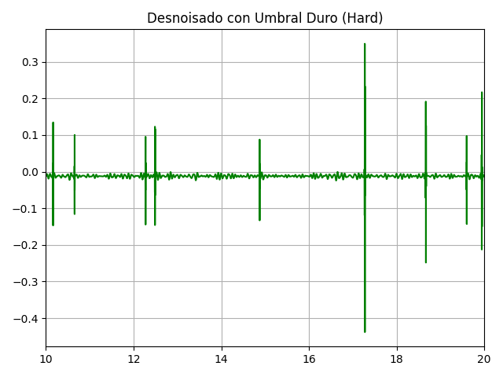

# Laboratorio 07 - Transformada Wavelet
## Contenido
1. [Introducción](#id1)
2. [Materiales y equipos](#id2)
3. [Propósito de la práctica](#id3)
4. [Metodología y Resultados](#id4) 
  4.1. [Señal ECG](#id5) 
  4.2. [Señal EMG](#id6) 
  4.3. [Señal EEG](#id7) 
5. [Discusiones](#id8)
6. [Referencias](#id9)

## 1. Introducción 

En la ingeniería biomédica, el análisis de señales como el electrocardiograma (ECG), electromiograma (EMG) y electroencefalograma (EEG) es esencial para el diagnóstico clínico y la investigación. Estas señales, al ser inherentemente no estacionarias, suelen presentar ruido y artefactos que dificultan su interpretación directa [1][2]. Ante esta complejidad, la Transformada Wavelet ha emergido como una herramienta matemática eficaz para el procesamiento de señales biomédicas, ya que permite una descomposición multiresolución que conserva simultáneamente la información temporal y frecuencial de la señal [3][4].

A diferencia de la Transformada de Fourier, que ofrece una visión global de las frecuencias sin indicar su localización temporal, la Transformada Wavelet adapta su resolución en función de la escala: proporciona alta resolución temporal para frecuencias altas y alta resolución en frecuencia para componentes de baja frecuencia [4][5]. Esta propiedad la convierte en una técnica ideal para la detección de eventos transitorios y patrones clínicos relevantes, como los complejos QRS en señales ECG, los artefactos de movimiento en EMG o las ondas anómalas en EEG asociadas con trastornos neurológicos [3][4][6].

La transformada wavelet puede implementarse principalmente de dos formas. La Transformada Wavelet Continua (CWT) realiza un análisis exhaustivo utilizando una variedad continua de escalas y posiciones, lo que proporciona alta precisión pero con una elevada redundancia y costo computacional [7]. Por otro lado, la Transformada Wavelet Discreta (DWT) emplea escalas y traslaciones discretas, permitiendo una representación más eficiente y compatible con sistemas digitales [8]. Esta última descompone la señal mediante filtros pasaaltos y pasabajos, separando sus componentes de alta y baja frecuencia y generando una estructura jerárquica en distintos niveles de resolución [1]. Además, la elección de la familia de wavelets es crucial según la naturaleza de la señal y el objetivo del análisis. Existen diversas opciones como Haar, Daubechies, Symlets, Coiflets y Morlet, cada una con características específicas en términos de suavidad, simetría y soporte compacto, que influyen en la calidad del procesamiento y la fidelidad de la reconstrucción [8].

## 2. Materiales y equipos 

|  **Modelo**  | **Descripción** | **Cantidad** | **Imagen** |
|:------------:|:---------------:|:------------:|:----------:|
|-|**Laptop o PC**: Laptop equipada con el programa Python 3.12 y las librerías neurokit2, matplotlib,scipy,numpy para poder implementar ahí el código y realizar los respectivos filtrados|1|<image width="300" height="100" src="https://eu-images.contentstack.com/v3/assets/blt07f68461ccd75245/blte12a184fec085629/6706c29adabd3cb01a7aff9c/Python-logo-1716x965_-_2024-10-09.jpg?width=1280&auto=webp&quality=95&format=jpg&disable=upscale">|

## 3. Propósito de la práctica 
Implementar y comparar el filtrado wavelet para reducir el ruido por artefactos producidos de las señales ECG, EMG y EEG.

## 4. Metodología 

### 4.1. Señal ECG 

Las señales ECG utilizadas en esta práctica fueron adquiridas en sesiones previas mediante electrodos de superficie conectados al sistema BITalino, siguiendo un protocolo de adquisición estandarizado. Se seleccionaron señales correspondientes a la primera derivada (1der) bajo cuatro condiciones fisiológicas distintas: reposo, respiración pausada, respiración prolongada y post ejercicio. Cada archivo fue procesado individualmente en el entorno de desarrollo Python 3.12.

En primer lugar, se realizó una visualización inicial de las señales crudas mediante scripts personalizados, utilizando la biblioteca opensignalsreader, luego, para el proceso de filtrado, se aplicaron dos configuraciones distintas de transformada wavelet discreta:

- Filtro Wavelet Symlet 4 (sym4) con un nivel de descomposición 3:

Seleccionado con base en su buen desempeño en señales ECG con niveles moderados de ruido, como se evidenció en estudios previos [9]. Se aplicó una umbralización suave (soft thresholding) con un umbral fijo ajustado empíricamente (umbral = 0.2) sobre todos los coeficientes.

- Filtro Wavelet Coiflet 3 (coif3) con un nivel de descomposición 7:

Esta configuración fue propuesta a partir de la literatura reciente, en la cual se evaluaron múltiples combinaciones de wavelets, umbrales y niveles de descomposición optimizados mediante particle swarm optimization (PSO). Los resultados reportaron que Coiflet 3 y niveles altos (L = 7–8) ofrecen un mejor rendimiento en condiciones de alto ruido, como es el caso del ECG post ejercicio [10].

En ambos casos, tras la descomposición wavelet, se umbralizaron los coeficientes utilizando la función pywt.threshold con modo 'soft', y luego se reconstruyó la señal filtrada con pywt.waverec. Finalmente, se ajustó la longitud de la señal reconstruida para que coincidiera con la original, y se graficaron los resultados:

| ECG Reposo | Filtro DWT |
|:-------------:|:-------------------:|
| Señal Original|  |
| Sym4          |  | 
| Coif3         |  |

 
| ECG Respiración | Filtro DWT |
|:-------------:|:-------------------:|
| Señal Original|  |
| Sym4          |  | 
| Coif3         |  |

| ECG Respiración prolongada | Filtro DWT |
|:-------------:|:-------------------:|
| Señal Original|  |
| Sym4          |  | 
| Coif3         |  |

| ECG Post-Ejercicio | Filtro DWT |
|:-------------:|:-------------------:|
| Señal Original|  |
| Sym4          |  | 
| Coif3         |  |

### 4.2. Señal EMG 

Las señales EMG utilizadas para el filtrado wavelet fueron adquiridas en laboratorios previos mediante electrodos de superficie conectados al sistema BITalino, siguiendo un protocolo de adquisición estandarizado. Se seleccionaron señales correspondientes al músculo bíceps braquial durante tres actividades distintas: reposo, esfuerzo leve y contracción máxima. Cada archivo fue procesado individualmente en el entorno de desarrollo Python 3.12.

La lectura de las señales crudas se realizó utilizando la biblioteca opensignalsreader y el filtrado wavelet se configuró con los siguientes parámetros:

|  **Función Wavelet**  | **Nivel** | **Umbral** | **Frecuencia** |
|:------------:|:---------------:|:------------:|:------------:|
|Daubechies 4 (db4)|5|0.109034|1000 Hz|

Los parámetros fueron escogidos en base a la literatura encontrada, donde se realizaron 3 métodos de filtrado wavelet y umbralización para señales sEMG [11].
El valor de umbral fue calculado mediante la siguiente ecuación: λ=σ.&radic;(2.log(n)). Donde λ es el valor de umbral calculado, σ es la desviación estándar del ruido y n es el número de coeficientes wavelet.
Los métodos elegidos para desarrollar esta práctica fueron el Hard y Soft Thresholding.
 	

#### Bíceps Braquial en reposo
| Señal| Gráfica obtenida|
|:-------------:|:-------------------:|
| Señal Cruda        |  |
| Soft Thresholding|  | 
| Hard Thresholding|  | 

#### Bíceps Braquial en esfuerzo leve
| Señal| Gráfica obtenida|
|:-------------:|:-------------------:|
| Señal Cruda        |  |
| Soft Thresholding|  | 
| Hard Thresholding|  | 

#### Bíceps Braquial en contracción máxima
| Señal| Gráfica obtenida|
|:-------------:|:-------------------:|
| Señal Cruda        |  |
| Soft Thresholding|  | 
| Hard Thresholding|  | 

### 4.3. Señal EEG 
El filtro utilizado, a partir de la literatura de referencia, para la eliminación de ruido en la señal es un filtro DWT tipo Biorthogonal 2.6, debido a su alta simetría, capacidad de separar eficazmente los componentes de frecuencia baja y alta y reconstrucción de la señal original y un nivel de 5. Los coeficientes de aproximación fueron A5 y de detalle D1, D2, D3, D4 y D5. [12]

	
|  **Función Wavelet**  | **Nivel** | **Umbral** | **Frecuencia** | **Coeficiente de aproximación** | **Coeficientes de detalle** | 
|:------------:|:---------------:|:------------:|:------------:|:------------:|:------------:|
|bior2.6 (Biorthogonal 2.6)|5|16|1000 Hz|A5| D1, D2, D3, D4, D5|

#### Resultados: 

| Campo | Señal Cruda | Filtro DWT |
|:-------------:|:------------:|:-------------------:|
| Basal |  |  |
| Tarea cognitiva |  |  |
| Lectura|  |  |

## 5. Discusiones y Conclusiones 

### ECG
Se evaluaron dos familias de wavelets comúnmente empleadas en el procesamiento de señales biomédicas: Symlet 4 y Coiflet 3 [9][10]. Durante la fase de análisis visual, se observaron diferencias significativas en el comportamiento de los filtros según la calidad de la señal original y el contexto de adquisición. En primer lugar, la señal ECG correspondiente al estado de reposo presentó un alto nivel de ruido, probablemente debido a interferencias electromagnéticas causadas por la proximidad a dispositivos eléctricos, lo cual es consistente con lo reportado por Malik et al., quienes identifican la interferencia de línea eléctrica (50/60 Hz) como uno de los artefactos más críticos en el registro electrocardiográfico [9]. En este caso, ambos filtros aplicados (sym4 y coif3) lograron atenuar parcialmente el ruido, aunque ninguno de ellos fue capaz de eliminarlo completamente. Esta limitación puede atribuirse a la naturaleza estacionaria y de banda estrecha de la interferencia, que puede requerir métodos complementarios como el filtrado iterativo.

Por otro lado, la señal correspondiente a respiración pausada presentó una morfología más limpia desde el inicio. El filtrado con ambos métodos fue exitoso, aunque se detectó un ligero suavizado adicional en la señal filtrada con Coiflet 3, lo que puede interpretarse como una mayor atenuación de los componentes de alta frecuencia, acorde con sus propiedades de mayor número de momentos de anulación y mejor regularidad matemática [10]. Una situación similar se evidenció en la señal ECG obtenida durante respiración prolongada, donde las diferencias entre los resultados de ambos filtros fueron mínimas, ya que se observo que el filtro coif3 ofreció una representación suavizada de la señal, aunque sin pérdida evidente de las características morfológicas relevantes del ECG. Esta capacidad para conservar las formas clínicas esenciales es esencial para garantizar la validez diagnóstica de la señal procesada [9].

En el caso de la señal ECG capturada post ejercicio, el ruido parecía moderado, probablemente derivado de artefactos por movimiento y actividad muscular. En este caso, las diferencias entre las señales filtradas fueron casi imperceptibles, lo cual puede deberse a que el ruido presente se ubicaba fuera de las bandas de frecuencia suprimidas por las wavelets aplicadas (0.5–40 Hz). Cabe destacar que Abdallah et al. enfatizan que el desempeño del filtrado wavelet depende no solo del tipo de wavelet, sino también de la correcta selección del nivel de descomposición y del método de umbralización aplicado sobre los coeficientes [10].

En conclusión, la aplicación de la transformada wavelet discreta demostró ser una herramienta efectiva para la mejora de la calidad de señales ECG en distintos contextos. La wavelet sym4 ofreció un balance entre suavizado y preservación de detalles morfológicos, mientras que coif3, especialmente con niveles más altos de descomposición, mostró una capacidad superior para suavizar señales en condiciones con menor ruido. Sin embargo, en situaciones con ruido significativo de tipo eléctrico, podría ser necesario complementar el filtrado wavelet con otras técnicas como la Lifting Wavelet Transform o estrategias adaptativas basadas en filtrado iterativo [2].

### EMG
Los métodos de umbralización analizados son el Hard y Soft Thresholding.

### EEG

## 6. Referencias 

[1] S. Kouro and R. Musalem, “Tutorial introductorio a la Teoría de Wavelet.” Disponble: http://www2.elo.utfsm.cl/~elo377/documentos/Wavelet.pdf.

[2] G. Antonio and L. Paredes, “Reconocimiento de patrones en electroforesis capilar utilizando análisis multiresolucional y programación dinámica / Gerardo Ceballos,” 2024. Disponible: https://www.researchgate.net/publication/44720047_Reconocimiento_de_patrones_en_electroforesis_capilar_utilizando_analisis_multiresolucional_y_programacion_dinamica_Gerardo_Ceballos

[3] T. Sharma and K. K. Sharma, "QRS Complex Detection in ECG Signals Using the Synchrosqueezed Wavelet Transform," IETE Journal of Research, vol. 62, no. 6, pp. 885-892, Nov.-Dec. 2016, doi: 10.1080/03772063.2016.1221744.

[4] P. Zandiyeh, L. R. Parola, B. C. Fleming, and J. E. Beveridge, "Wavelet analysis reveals differential lower limb muscle activity patterns long after anterior cruciate ligament reconstruction," Journal of Biomechanics, vol. 133, p. 110957, 2022, doi: 10.1016/j.jbiomech.2022.110957.

[5] N. N. B and D. Marcela, “El uso de la transformada wavelet discreta en la reconstrucción de señales senosoidales.,” Scientia et Technica, vol. 1, no. 38, pp. 381–386, 2024‌‌.

[6] S. Mallat, "Chapter 3 - Discrete Revolution," in A Wavelet Tour of Signal Processing, 3rd ed., San Diego, CA, USA: Academic Press, 2009, pp. 59-88.

[7] R. González G., "Capítulo 3: Revisión de la Teoría de Wavelets," Universidad de las Américas Puebla, Puebla, México. Disponible: https://catarina.udlap.mx/u_dl_a/tales/documentos/mel/gonzalez_g_ra/capitulo3.pdf.

[8]  E. Pinto Moreno, "Familias de Wavelets," Universidad Carlos III de Madrid, Madrid, España. Disponible: https://e-archivo.uc3m.es/bitstream/10016/16582/1/PFC_Elena_Pinto_Moreno_Anexos.pdf. 

[9] Malik, S. A., Parah, S. A., Aljuaid, H., & Malik, B. A. (2023). An Iterative Filtering Based ECG Denoising Using Lifting Wavelet Transform Technique. Electronics, 12(2), 387. https://doi.org/10.3390/electronics12020387

[10] Abdallah, Azzouz & Bengherbia, Billel & Wira, Patrice & Alaoui, Nail & Souahlia, Abdelkerim & Maazouz, Mohamed & Hentabeli, Hamza. (2024). An efficient ECG signals denoising technique based on the combination of particle swarm optimisation and wavelet transform. Heliyon. 10. e26171. 10.1016/j.heliyon.2024.e26171. 

[11] Yao L, Sun SQ, Li L. Application of Improved Wavelet Threshold Method in SEMG De-Noising Processing. Applied Mechanics and Materials [Internet]. 2012 Nov [cited 2025 May 29];220-223:2253–6. Available from: https://doi.org/10.4028/www.scientific.net/AMM.220-223.2253

[12] A. W. Pise and P. P. Rege, "Comparative analysis of various filtering techniques for denoising EEG signals," in 2021 6th International Conference for Convergence in Technology (I2CT), Maharashtra, India, 2021, pp. 1-4, doi: 10.1109/I2CT51068.2021.9417984.
