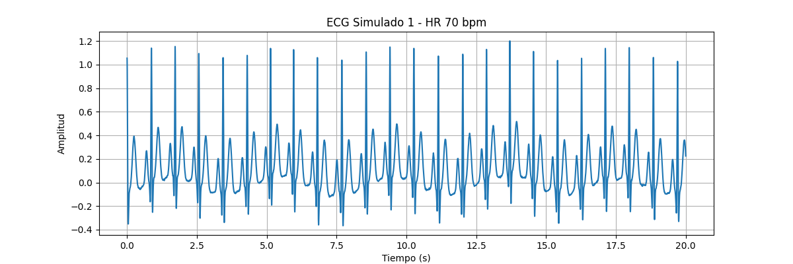
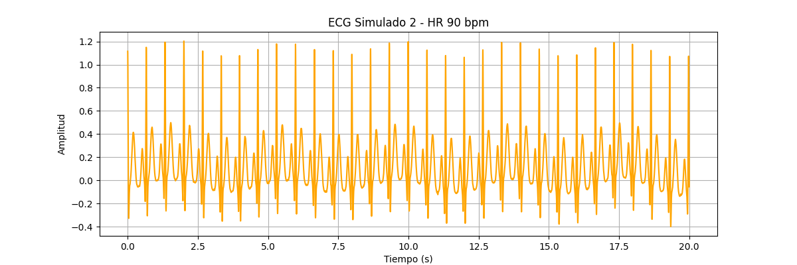
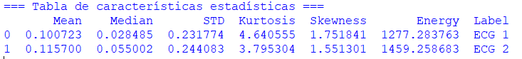
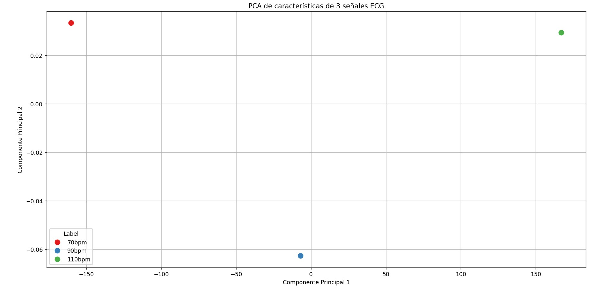
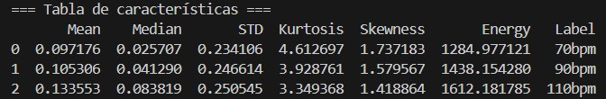
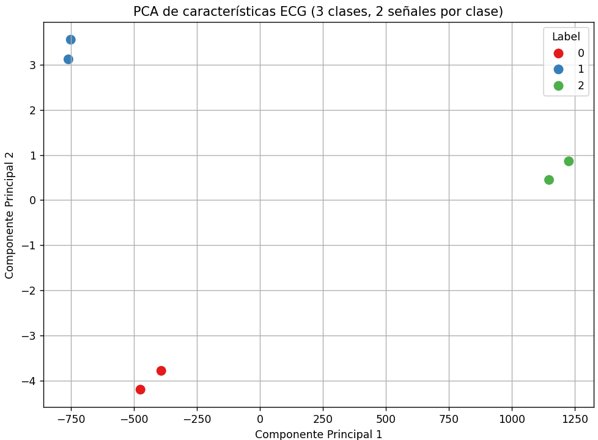
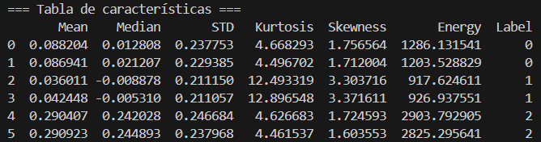

# Laboratorio 10 - EKG processing
## Contenido
1. [Actividad 1](#id1)
2. [Actividad 2](#id2)
3. [Actividad 3](#id3)
4. [Actividad 4](#id4)
5. [Actividad para casa](#id5)
6. [Referencias](#id6)


## 1. Actividad 1 <a name="id1"></a>

### Objetivo: 
- Generar 2 señales EKG de duración 20 s
- Gráfica de forma independiente estas señales

### Desarrollo:

1. Importamos las librerías necesarias para su desarrollo:
```bash
import neurokit2 as nk
import matplotlib.pyplot as plt
import numpy as np
```
2. Definimos los parámetros acorde a lo solicitado:
```bash
duration = 20  # segundos
sampling_rate = 1000  # Hz
heart_rate_1 = 70
heart_rate_2 = 90
```
3. Simulamos la señal ECG mediante la función ecg_simulate() de neurokit v.2:
```bash
# Señal 1: ECG con HR = 70 bpm
ecg1 = nk.ecg_simulate(duration=duration, 
                       sampling_rate=sampling_rate, 
                       heart_rate=heart_rate_1, 
                       method='ecgsyn')

# Señal 2: ECG con HR = 90 bpm
ecg2 = nk.ecg_simulate(duration=duration, 
                       sampling_rate=sampling_rate, 
                       heart_rate=heart_rate_2, 
                       method='ecgsyn')
```
4. Creamos el vector tiempo para realizar la gráfica:
```bash
time = np.linspace(0, duration, duration * sampling_rate)
```
5. Finalmente, graficamos mediante el uso de la librería matplotlib:
```bash
# Graficar ECG 1
plt.figure(figsize=(12, 4))
plt.plot(time, ecg1)
plt.title("ECG Simulado 1 - HR 70 bpm")
plt.xlabel("Tiempo (s)")
plt.ylabel("Amplitud")
plt.grid(True)
plt.show()

# Graficar ECG 2
plt.figure(figsize=(12, 4))
plt.plot(time, ecg2, color='orange')
plt.title("ECG Simulado 2 - HR 90 bpm")
plt.xlabel("Tiempo (s)")
plt.ylabel("Amplitud")
plt.grid(True)
plt.show()
```
### Resultados:





## 2. Actividad 2 <a name="id2"></a>

### Objetivo: 
- Para cada señal simulada, extraer las características básicas

### Desarrollo:
1. Importamos las librerías necesarias para su desarrollo:
```bash
import neurokit2 as nk
import numpy as np
import pandas as pd
from scipy.stats import kurtosis, skew
import matplotlib.pyplot as plt
```
2. Se mantiene todo el código de la actividad 1, pero se añade para la obtención de los valores:
```bash
signals = [ecg1, ecg2]
labels = ["ECG 1", "ECG 2"]

# Extraer valores específicos
def extract_features(ecg_signal):
    return {
        "Mean": np.mean(ecg_signal),
        "Median": np.median(ecg_signal),
        "STD": np.std(ecg_signal),
        "Kurtosis": kurtosis(ecg_signal),
        "Skewness": skew(ecg_signal),
        "Energy": np.sum(ecg_signal**2)
    }

features = []
for i, ecg in enumerate(signals):
    feats = extract_features(ecg)
    feats["Label"] = labels[i]
    features.append(feats)

df_features = pd.DataFrame(features)
```
3. Finalmente, se imprime los valores en una tabla mediante Pandas:
```bash
print("\n=== Tabla de características estadísticas ===")
print(df_features)
```

### Resultado:



## 3. Actividad 3 <a name="id3"></a>

### Objetivo: 
- Extraer caracteristicas de 3 señasl EKG, reducir la dimensionalidad con PCA y graficas el scatterplot

### Desarrollo:
1. Importamos las librerías necesarias para su desarrollo:
```bash
import neurokit2 as nk
import numpy as np
import pandas as pd
import matplotlib.pyplot as plt
from scipy.signal import welch
from scipy.stats import linregress
```
2. Realizamos la configuración de los segmentos de simulación:
```bash
segmentos = []
duracion_segmento = 10  # en segundos
sampling_rate = 1000
burst_nums = [10, 7, 4]
amplitudes = [1.0, 1.5, 2.0]
```
3. Simulamos cada segmento EMG:
```bash
for bursts, amp in zip(burst_nums, amplitudes):
    seg = nk.emg_simulate(duration=duracion_segmento, sampling_rate=sampling_rate,
                          burst_number=bursts, noise=0.01)
    seg *= amp
    segmentos.append(seg)
```

### Resultado:





## 4. Actividad 4 <a name="id4"></a>

### Objetivo: 
- De las 3 señales EKG creada, creado 3 mas adicionales con las mismas caracteristicas de estas 3 iniciales.
- Extrae sus caracteristicas y ponlos en una tabla en pandas, luego etiqueta estas señales. ejemplo: 0,1,2.
- Reduce las dimensionalidad a 2 y grafica si existe separabilidad.

### Desarrollo:
1. Importamos las librerías necesarias para su desarrollo:
```bash
import neurokit2 as nk
import numpy as np
import pandas as pd
import matplotlib.pyplot as plt
from scipy.signal import welch
from scipy.stats import linregress
```
2. Definimos los parámetros generales para la simulación ECG:
```bash
fs = 1000
duration = 20
np.random.seed(42)
```
3. Especificamos los parámetros de la señal y simulamos:
```bash
ti0 = np.array([-70, -15, 0, 15, 100])
ai0 = np.array([1.2, -5, 30, -7.5, 0.75])
bi0 = np.array([0.25, 0.1, 0.1, 0.1, 0.4])

ecg0 = nk.ecg_simulate(duration=duration, sampling_rate=fs, method="ecgsyn", ti=ti0, ai=ai0, bi=bi0)
```

4. Creamos una señal ECG de clase 1 con parámetros modificados ligeramente mediante ruido gaussiano:
```bash
ti1 = np.random.normal(ti0, 3)
ai1 = np.random.normal(ai0, np.abs(ai0 / 5))
bi1 = np.random.normal(bi0, np.abs(bi0 / 5))
ecg1 = nk.ecg_simulate(duration=duration, sampling_rate=fs, method="ecgsyn", ti=ti1, ai=ai1, bi=bi1)
```

5. Simulamos una señal ECG anómala (clase 2) con onda T invertida y complejo QRS más ancho:
```bash
ti2 = np.random.normal(ti0, 3)
ai2 = np.random.normal(ai0, np.abs(ai0 / 5))
bi2 = np.random.normal(bi0, np.abs(bi0 / 5))
ai2[4] = -0.5  # T invertida
bi2[2] *= 2    # QRS ancho
ecg2 = nk.ecg_simulate(duration=duration, sampling_rate=fs, method="ecgsyn", ti=ti2, ai=ai2, bi=bi2)
```

6. Generamos una segunda señal ECG para cada clase usando los mismos parámetros originales:
```bash
ecg0_bis = nk.ecg_simulate(duration=duration, sampling_rate=fs, method="ecgsyn", ti=ti0, ai=ai0, bi=bi0)
ecg1_bis = nk.ecg_simulate(duration=duration, sampling_rate=fs, method="ecgsyn", ti=ti1, ai=ai1, bi=bi1)
ecg2_bis = nk.ecg_simulate(duration=duration, sampling_rate=fs, method="ecgsyn", ti=ti2, ai=ai2, bi=bi2)
```

7. Agrupamos todas las señales y etiquetamos:
```bash
signals = [ecg0, ecg0_bis, ecg1, ecg1_bis, ecg2, ecg2_bis]
labels = [0, 0, 1, 1, 2, 2]
```

8. Extraemos características y almacenamos:
```bash
def extract_features(signal):
    return {
        "Mean": np.mean(signal),
        "Median": np.median(signal),
        "STD": np.std(signal),
        "Kurtosis": kurtosis(signal),
        "Skewness": skew(signal),
        "Energy": np.sum(signal**2)
    }

features = []
for i, ecg in enumerate(signals):
    feats = extract_features(ecg)
    feats["Label"] = labels[i]
    features.append(feats)
```

9. Convertimos la lista de características en un DataFrame y mostramos la tabla:
```bash
df = pd.DataFrame(features)

print("\n=== Tabla de características ===")
print(df)
```

10. Separamos los datos y etiquetas, a continuación, aplicamos PCA:
```bash
X = df.drop(columns=["Label"])
y = df["Label"]

pca = PCA(n_components=2)
X_pca = pca.fit_transform(X)
```

11. Creamos un nuevo DataFrame con las componentes principales y las etiquetas. Finalmente, graficamos:
12. ```bash
df_pca = pd.DataFrame(X_pca, columns=["PC1", "PC2"])
df_pca["Label"] = y.astype(str)

plt.figure(figsize=(8, 6))
sns.scatterplot(data=df_pca, x="PC1", y="PC2", hue="Label", palette="Set1", s=100)
plt.title("PCA de características ECG (3 clases, 2 señales por clase)")
plt.xlabel("Componente Principal 1")
plt.ylabel("Componente Principal 2")
plt.grid(True)
plt.tight_layout()
plt.show()
```
### Resultado:





## 5. Actividad para casa <a name="id5"></a>

### Objetivo: 
- Continuar con la actividad de clase pero incluir los coeficientes de DWT.

### Desarrollo:
1. Importamos las librerías necesarias para su desarrollo:
```bash
import neurokit2 as nk
import numpy as np
import pandas as pd
import matplotlib.pyplot as plt
from scipy.signal import welch
from scipy.stats import linregress
```
2. Realizamos la configuración de los segmentos de simulación:
```bash
segmentos = []
duracion_segmento = 10  # en segundos
sampling_rate = 1000
burst_nums = [10, 7, 4]
amplitudes = [1.0, 1.5, 2.0]
```
3. Simulamos cada segmento EMG:
```bash
for bursts, amp in zip(burst_nums, amplitudes):
    seg = nk.emg_simulate(duration=duracion_segmento, sampling_rate=sampling_rate,
                          burst_number=bursts, noise=0.01)
    seg *= amp
    segmentos.append(seg)
```

### Resultado:
asdas


## 3. Bibliografía <a name="id6"></a>

[1] (https://neuropsychology.github.io/NeuroKit/)

[2] N. Nazmi et al., “A Review of Classification Techniques of EMG Signals during Isotonic and Isometric Contractions,” Sensors, vol. 16, no. 8, p. 1304, 2016. [En línea]. Disponible en: https://doi.org/10.3390/s16081304

[3] M. B. I. Raez, M. S. Hussain y F. Mohd-Yasin, “Techniques of EMG signal analysis: detection, processing, classification and applications,” Biological Procedures Online, vol. 8, pp. 11–35, 2006. [En línea]. Disponible en: https://doi.org/10.1251/bpo115

[4] NeuroKit2 Documentation, “EMG Signal Processing,” [En línea]. Disponible en: https://neurokit2.readthedocs.io/en/latest/functions/emg.html

