# Laboratorio 11 - MNE-EEG
## Contenido
1. [Origen de los datos](#id1)
2. [Procedimiento de preprocesamiento](#id2)
3. [Extracción de características](#id3)
4. [Optimización y selección](#id4)

## 1. Origen de los datos 

### Objetivo: 
- Detallar recolección con Ultracortex (frecuencia de muestreo, nro. de electrodos) o la base de datos usada (nombre, URL).

### Desarrollo:
Los datos utilizados provienen de la base de datos **EEG Motor Movement/Imagery Dataset**, disponible públicamente en PhysioNet, con las siguientes características:
- **Frecuencia de muestreo**: 160 Hz
- **Número de canales/electrodos**: 64
- **Montaje**: Sistema internacional 10-10 (excepto Nz, F9, F10, FT9, FT10, A1, A2, TP9, TP10, P9 y P10)
- **Formato**: EDF+ (European Data Format Plus)
- **Descripción**:
  - Se recopilaron registros EEG de 109 voluntarios mientras realizaban (o imaginaban) movimientos motores específicos (manos, pies) en diferentes condiciones experimentales.
  - Cada sujeto completó 14 sesiones experimentales, que incluyeron:
    - Tareas en reposo con ojos abiertos/cerrados
    - Movimientos reales e imaginados de manos y pies, en respuesta a estímulos visuales en pantalla.
  - Las anotaciones T0, T1 y T2 indican respectivamente: reposo, movimiento de mano izquierda/brazos, o pie derecho/piernas (dependiendo de la tarea).
- Fuente: Schalk, G., McFarland, D.J., Hinterberger, T., Birbaumer, N., Wolpaw, J.R. BCI2000: A General-Purpose Brain-Computer Interface (BCI) System. IEEE Transactions on Biomedical Engineering 51(6):1034-1043, 2004. https://www.physionet.org/content/eegmmidb/1.0.0/

## 2. Procedimiento de preprocesamiento 

### Objetivo: 
- Limpiar las señales de EEG mediante técnicas de filtrado (por ejemplo, filtros pasa-banda, notch y wavelet), eliminar artefactos (blink, EMG, ECG) y normalizar/alinear las señales para hacerlas comparables entre sesiones y sujetos.

### Desarrollo de característica 1:
El preprocesamiento se realizó utilizando **MNE-Python** y consistió en los siguientes pasos:

- **Lectura del archivo**: Se utilizaron los archivos `S001R01.edf` a `S001R10.edf`, correspondientes a tareas motoras reales e imaginadas del sujeto S001 de la base de datos PhysioNet EEG Motor Movement/Imagery Dataset.
- **Montaje**: Se aplicó el sistema estándar **10-20** con la función `set_montage('standard_1020')` para ubicar correctamente los electrodos.
- **Filtro pasa banda**: Se aplicó un filtro entre **1 y 40 Hz** para eliminar componentes de baja frecuencia (artefactos de movimiento y deriva DC) y alta frecuencia (ruido muscular o eléctrico).
- **Filtro notch**: Se utilizó un filtro a **60 Hz** para suprimir la interferencia de la red eléctrica.
- **Interpolación de canales**: No se detectaron canales ruidosos en esta muestra específica, por lo que `raw.info['bads'] = []`. En caso de detección visual, se podrían interpolar automáticamente con `interpolate_bads()`.
- **Eliminación de artefactos**: Se utilizó **Análisis de Componentes Independientes (ICA)** con 20 componentes (`n_components=20`). Se eliminaron manualmente los componentes relacionados con artefactos de parpadeo (ej. componente 0), identificados con `ica.plot_components()`.
- **Herramientas**: MNE-Python, matplotlib, numpy

#### Archivos EDF descargados – Sujeto S001
Se utilizó el código python adjuntado [`señal_cruda.py`](señal_cruda.py) para graficar cada uno de los archivos detallados a continuación:

| Archivo       | Descripción                                                  | Señal cruda                          | PSD                                  |
|---------------|--------------------------------------------------------------|---------------------------------------|---------------------------------------|
| S001R01.edf   | Baseline – ojos abiertos                                     | 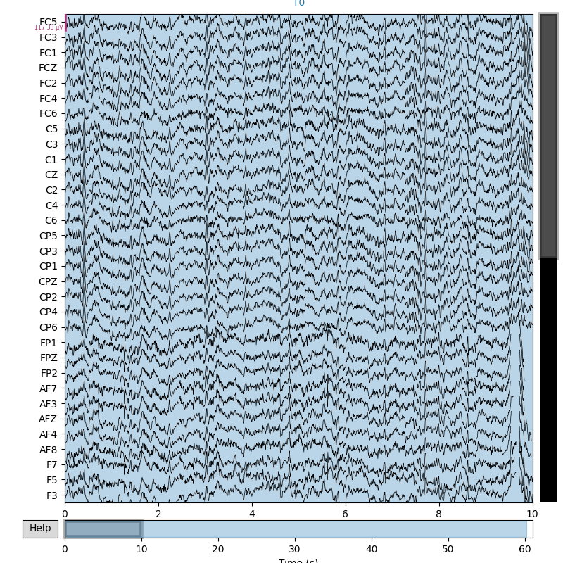     | 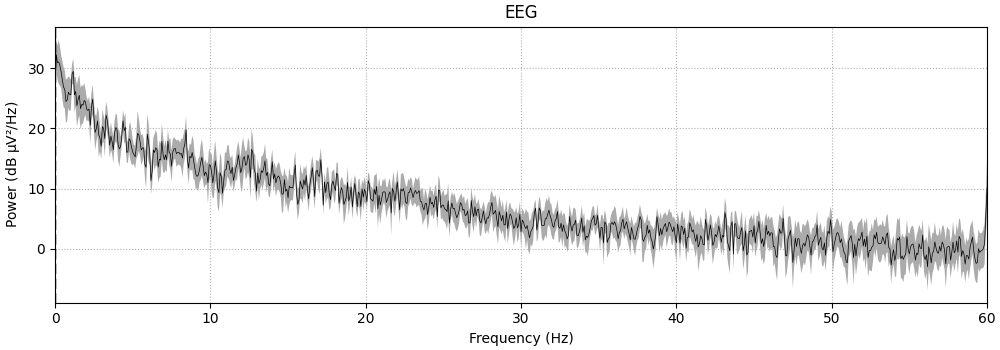     |
| S001R02.edf   | Baseline – ojos cerrados                                     | 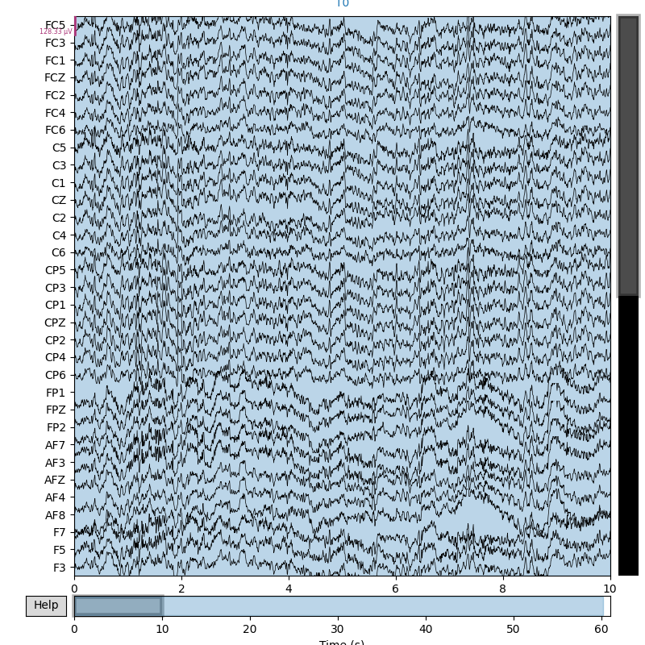     | 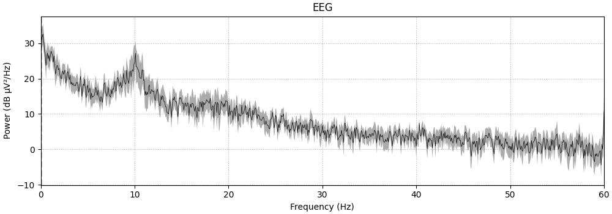     |
| S001R03.edf   | Tarea 1 – Movimiento real, mano izquierda o derecha          | 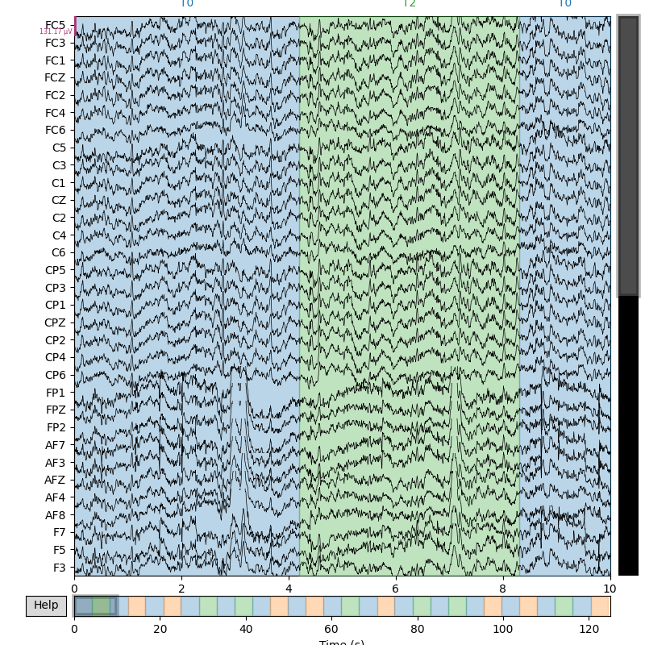     | 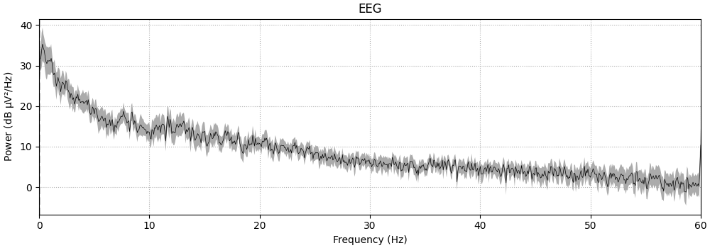     |
| S001R04.edf   | Tarea 2 – Movimiento imaginado, mano izquierda o derecha     | 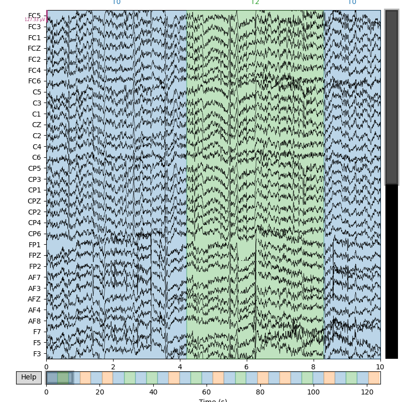     | 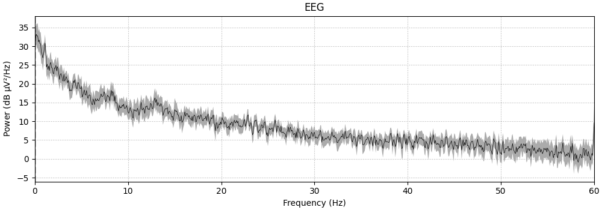     |
| S001R05.edf   | Tarea 3 – Movimiento real, ambas manos o ambos pies          | 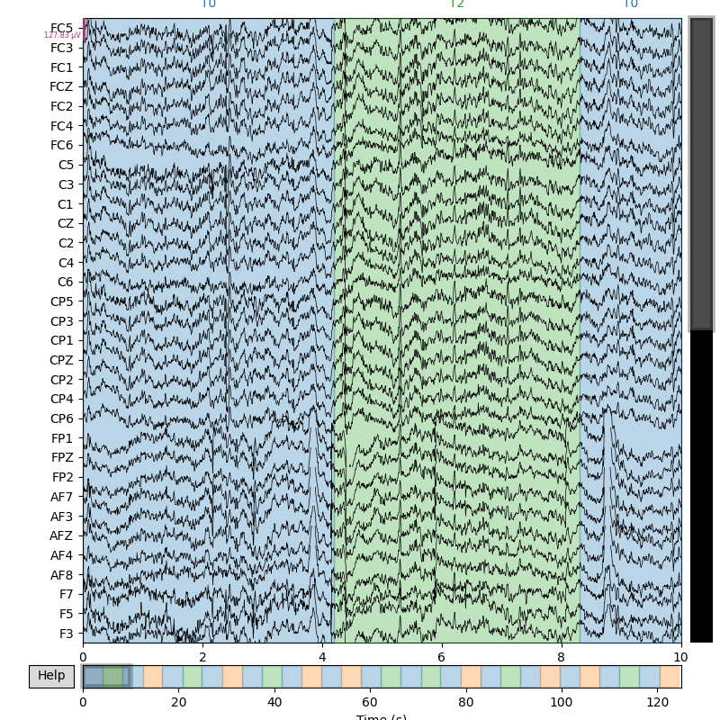     | 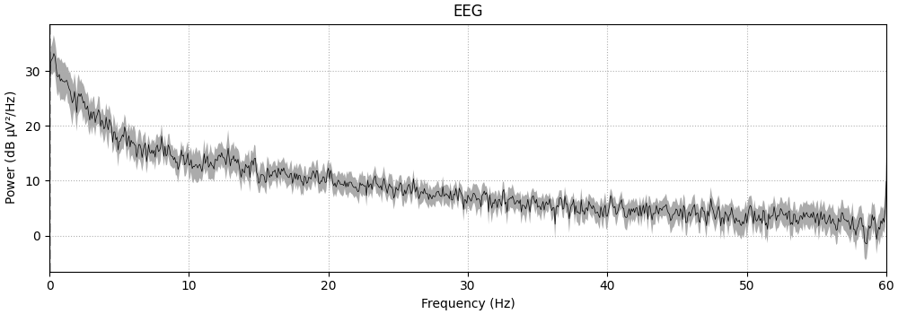     |
| S001R06.edf   | Tarea 4 – Movimiento imaginado, ambas manos o ambos pies     | 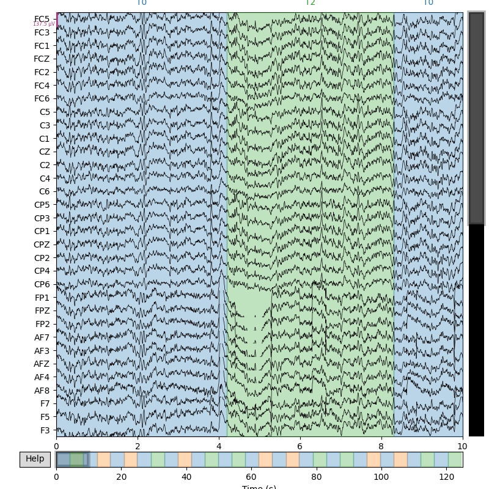     | 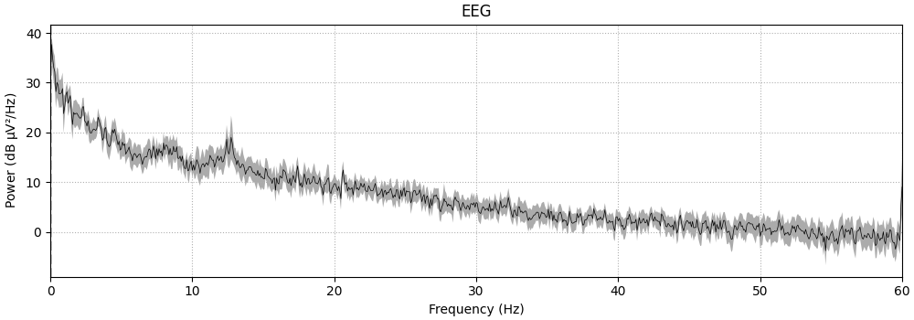     |
| S001R07.edf   | Repetición de Tarea 1 (real – manos)                         | 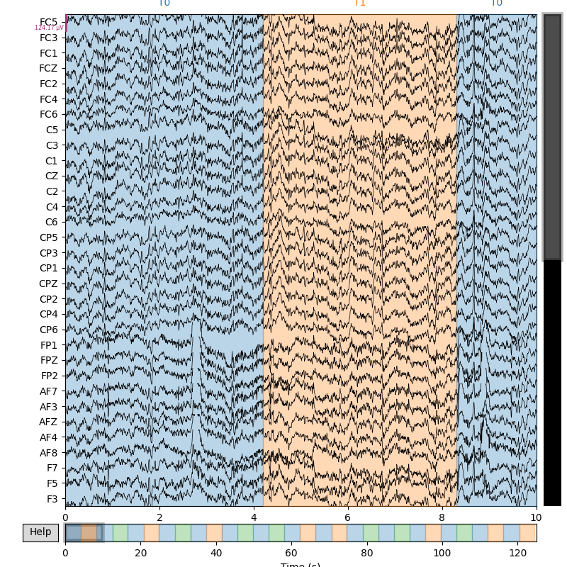     | 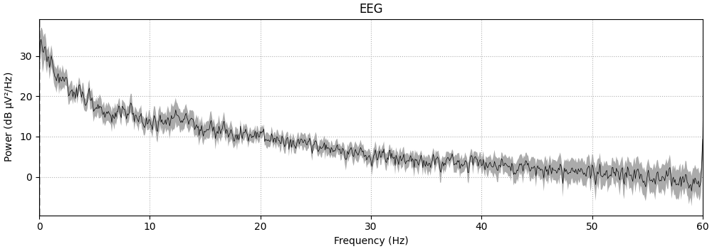     |
| S001R08.edf   | Repetición de Tarea 2 (imaginada – manos)                    | 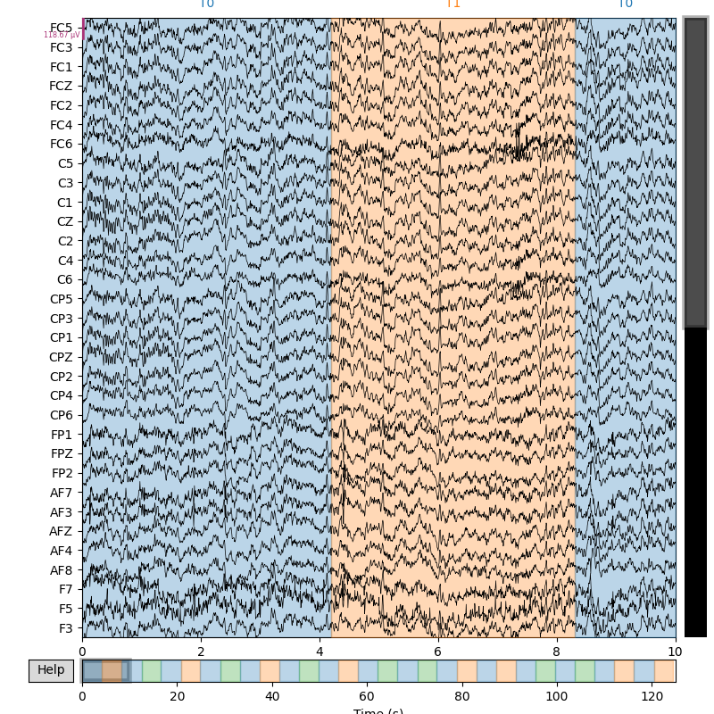     | 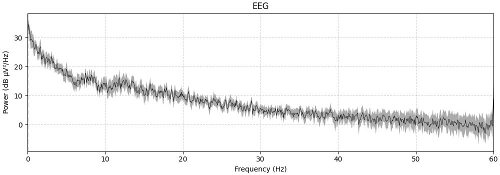     |
| S001R09.edf   | Repetición de Tarea 3 (real – manos/pies)                    | 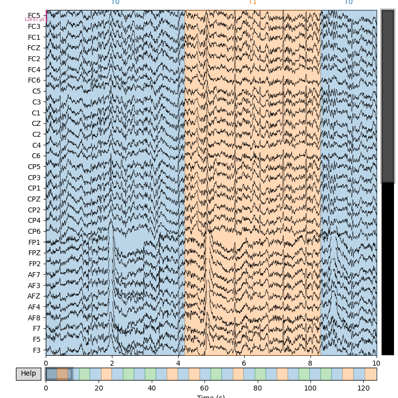     |      |
| S001R10.edf   | Repetición de Tarea 4 (imaginada – manos/pies)              | 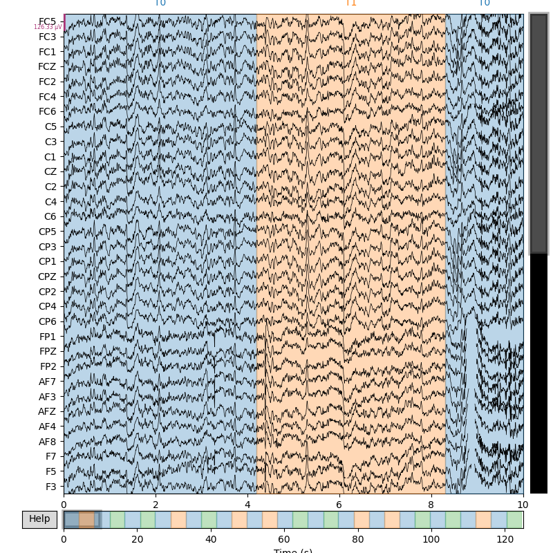     | 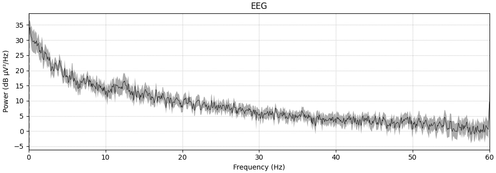     |

## 3. Extracción de características 

### Objetivo: 
- Aplicar técnicas de feature engineering sobre las componentes extraídas (estadísticas, bandas, transformaciones) para mejorar la calidad de los datos antes de alimentar modelos de clasificación.

### Características basadas en energía de bandas:
Se utilizó el método de densidad espectral de potencia (PSD) mediante Welch (`raw.compute_psd`) aplicado sobre las señales preprocesadas. Posteriormente, se integró la PSD dentro de los rangos de frecuencia definidos para cada banda, y se calculó el promedio de energía por banda y archivo, todo el procedimiento realizado se encuentra en el archivo [`caracteristica1.py`](caracteristica1.py).

Las bandas utilizadas fueron:

- **Delta:** 0.5 – 4 Hz  
- **Theta:** 4 – 8 Hz  
- **Alpha:** 8 – 13 Hz  
- **Beta:** 13 – 30 Hz

#### Tabla de energía promedio por banda (en µV²)

| Archivo     | Delta (µV²) | Theta (µV²) | Alpha (µV²) | Beta (µV²) |
|-------------|-------------|-------------|-------------|------------|
| S001R01.edf | 882.220     | 210.808     | 147.445     | 159.463    |
| S001R02.edf | 762.678     | 210.683     | 754.201     | 241.251    |
| S001R03.edf | 1273.054    | 254.237     | 147.465     | 193.194    |
| S001R04.edf | 1366.961    | 271.166     | 137.015     | 175.411    |
| S001R05.edf | 1396.854    | 261.436     | 128.215     | 183.513    |
| S001R06.edf | 884.769     | 197.510     | 176.568     | 156.491    |
| S001R07.edf | 1466.666    | 225.905     | 163.607     | 185.790    |
| S001R08.edf | 763.526     | 170.368     | 148.876     | 165.080    |
| S001R09.edf | 1345.150    | 233.474     | 154.005     | 187.111    |
| S001R10.edf | 1192.647    | 225.719     | 164.085     | 175.411    |

#### Visualización:
La siguiente figura muestra una comparación visual de la energía promedio por banda EEG a lo largo de las diferentes sesiones:

### Características basadas en Wavelet:
Se aplicó una transformada wavelet discreta (DWT) utilizando la función pywt.wavedec() de la librería PyWavelets, con los siguientes parámetros:
- **Wavelet utilizada:** Daubechies 4 ('db4')  
- **Niveles de descomposición:** 4 niveles
- **Señal de entrada:** canal promedio de cada archivo EEG preprocesado
- **Feature extraída:** varianza de los coeficientes en cada nivel (cA4, cD4, cD3, cD2, cD1)
- **Herramientas**: MNE-Python, PyWavelets, numpy

Durante el análisis, elegí conservar los niveles `cA4`, `cD4`, `cD3`, `cD2` y `cD1`, ya que estos cubren un rango de frecuencias que se alinean bien con las bandas cerebrales clásicas del EEG. Como se trabajó con señales muestreadas a 160 Hz, los niveles wavelet pueden asociarse aproximadamente con los siguientes rangos de frecuencia:

| Nivel | Rango aprox. (Hz) | Asociado a banda |
|-------|-------------------|------------------|
| `A4`  | 0 – 5             | Delta            |
| `D4`  | 5 – 10            | Theta            |
| `D3`  | 10 – 20           | Alpha            |
| `D2`  | 20 – 40           | Beta             |
| `D1`  | 40 – 80           | Gamma            |

Estos valores se calculan considerando que en cada nivel la frecuencia se reduce a la mitad (principio del muestreo y la descomposición wavelet). Por esta razón, y dado que el interés principal está en las bandas delta, theta, alpha y beta, se extrajo la **varianza de los coeficientes** de cada uno de estos niveles, ya que la varianza representa una medida de la energía contenida en cada banda correspondiente.

Esta forma de análisis resulta útil para extraer características más localizadas en tiempo-frecuencia, complementando el enfoque clásico basado en PSD.

Todo el procedimiento se encuentra en el archivo adjunto [`caracteristica2.py`](caracteristica2.py).

#### Tabla de características extraídas mediante DWT:
| Archivo      | cA4 (µV²) | cD4 (µV²)| cD3 (µV²)| cD2 (µV²)| cD1 (µV²)|
|--------------|-----------|----------|---------|---------|---------|
| S001R01.edf  | 13528.06  | 2389.20  | 941.28  | 197.59  | 15.02   |
| S001R02.edf  | 8489.32   | 4543.38  | 1930.04 | 262.85  | 17.14   |
| S001R03.edf  | 17045.93  | 2761.76  | 1099.47 | 243.76  | 19.59   |
| S001R04.edf  | 13181.67  | 2480.51  | 947.90  | 243.90  | 19.48   |
| S001R05.edf  | 16077.17  | 2550.74  | 964.84  | 265.99  | 23.32   |
| S001R06.edf  | 15601.62  | 2477.73  | 1115.76 | 203.33  | 13.86   |
| S001R07.edf  | 14028.24  | 2381.60  | 976.95  | 198.47  | 14.37   |
| S001R08.edf  | 11417.22  | 2280.13  | 912.21  | 189.31  | 13.89   |
| S001R09.edf  | 14461.91  | 2429.34  | 952.61  | 260.91  | 21.89   |
| S001R10.edf  | 13901.02  | 2685.98  | 960.97  | 219.74  | 18.65   |

## 4. Optimización y selección 

### Objetivo: 
- Integrar y analizar los datos a través de observaciones temporales, frecuenciales y espaciales empleando MNE-Python (Epochs, Evoked, montage, interpolate_bads).
