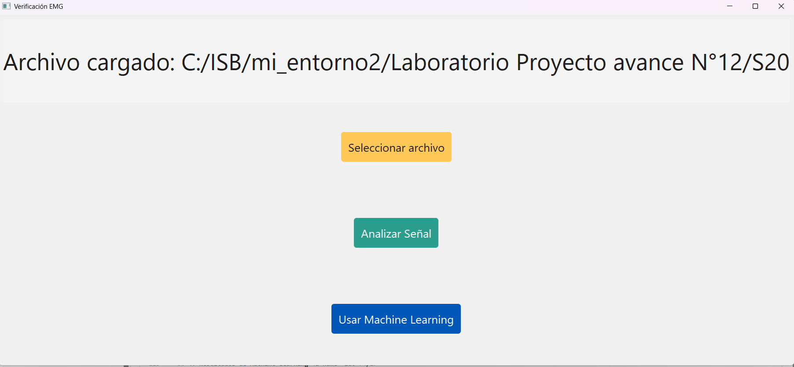
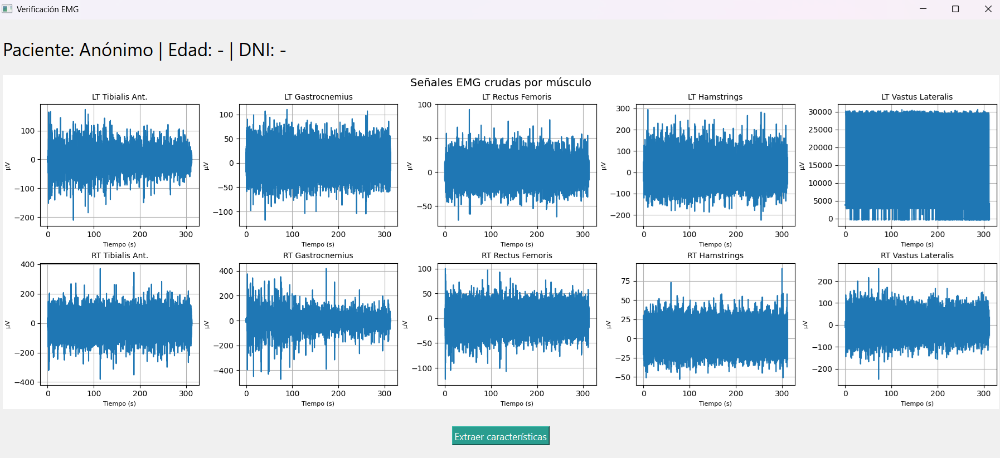
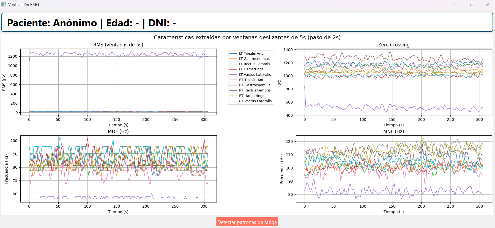
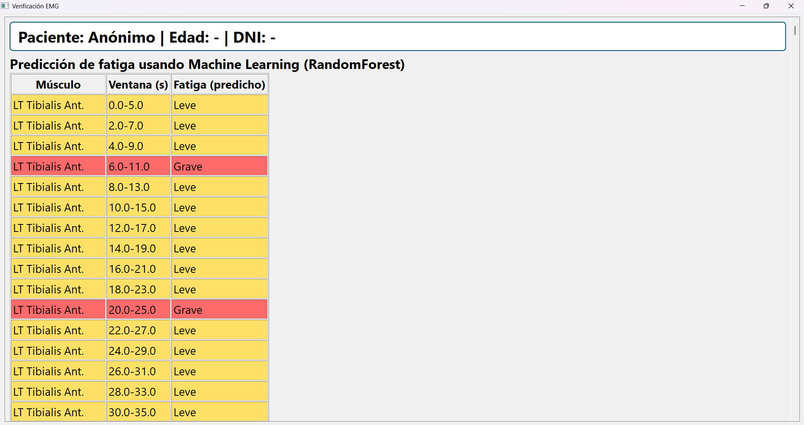
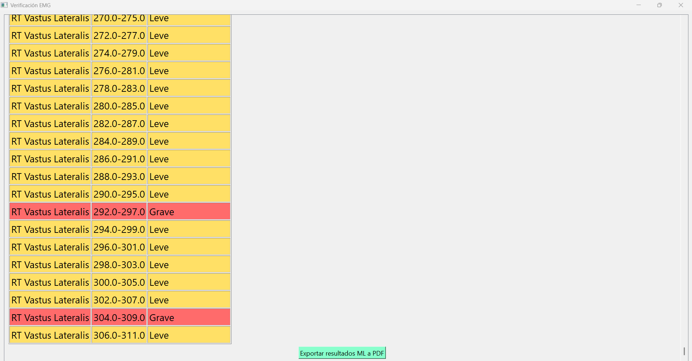
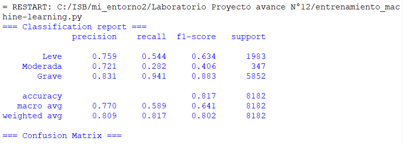
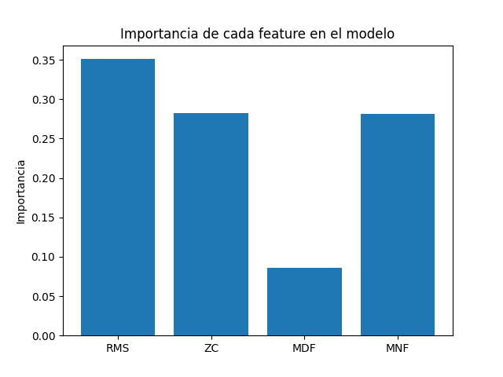

# Laboratorio 13 - Avance del proyecto 2

## Proyecto: Análisis de señales EMG para detección de patrones de fatiga muscular en miembro inferior

## 🎯 Objetivo

Desarrollar un pipeline en Python que permita analizar señales electromiográficas (EMG) de miembros inferiores para identificar posibles patrones de fatiga muscular, basándose en características extraídas del dominio temporal y su evolución durante caminatas prolongadas.

## Contenido
1. [Origen de los datos](#id1)
2. [Pipeline y tecnologías utilizadas](#id2)
3. [Flujo de la aplicación y métodos implementados](#id3)
4. [Resultados de Machine Learning](#id4)

---

## Evolución del enfoque

### Avance previo:
- El análisis se realizaba sobre la señal completa de cada canal EMG (una sola ventana).

### Avance actual:
- Se implementó un análisis por ventanas deslizantes de 5 segundos (con paso de 2 s), permitiendo identificar cómo evoluciona la fatiga muscular a lo largo del tiempo y de la marcha.
- Se siguieron recomendaciones de la literatura: A Review of Muscle Fatigue Assessment by Surface EMG Analysis (Sensors, 2022): “Sliding windows of 1–5 s are commonly used for calculation of MNF, MDF, and RMS in dynamic protocols. For fatigue detection in walking or running, 5 s windows provide a good balance between smoothness and temporal resolution. MDF and MNF are calculated in windows of 2–5 s for both static and dynamic contractions, being 5 s preferable in long duration or noisy recordings.” DOI:10.3390/s22155799
- Exportación automática de dataset para entrenamiento ML.
- Entrenamiento y validación de un modelo RandomForest específico para la detección de fatiga.
- Integración del modelo ML en la app, permitiendo comparación directa con el método tradicional.
- Nuevas funciones de interfaz: anonimato, scroll.

## 1. Origen de los datos 

Se utilizará la base de datos pública:

**📚 Nombre:**  
*Surface electromyographic signals collected during long-lasting ground walking of young able-bodied subjects*

**🔗 Enlace:**  
[PhysioNet - semg/1.0.1](https://physionet.org/content/semg/1.0.1/)

**Descripción:**
- 31 sujetos sanos (20–30 años), caminando durante **~5 minutos** por una ruta en forma de “8” (curvas + tramos rectos).
- Señales **sEMG** obtenidas de **10 músculos del miembro inferior** (5 por pierna) y separados por canales dentro del archivo .hea:

| Canal | Etiqueta del canal | Músculo                 | Lado      |
| :---: | ------------------ | ----------------------- | --------- |
|   2   | `semg LT TIB.A`    | Tibialis anterior       | Izquierdo |
|   3   | `semg LT LAT.G`    | Gastrocnemius lateralis | Izquierdo |
|   4   | `semg LT REC.F`    | Rectus femoris          | Izquierdo |
|   5   | `semg LT HAM`      | Hamstrings              | Izquierdo |
|   6   | `semg LT LAT.V`    | Vastus lateralis        | Izquierdo |
|   9   | `semg RT TIB.A`    | Tibialis anterior       | Derecho   |
|   10  | `semg RT LAT.G`    | Gastrocnemius lateralis | Derecho   |
|   11  | `semg RT REC.F`    | Rectus femoris          | Derecho   |
|   12  | `semg RT HAM`      | Hamstrings              | Derecho   |
|   13  | `semg RT LAT.V`    | Vastus lateralis        | Derecho   |
  
- Registro simultáneo de:  
  - sEMG (μV)  
  - Footswitch (V)
  - Electrogoniometría (°)
- Formato de archivo: `.dat` y `.hea` (compatible con `wfdb` en Python)
- Frecuencia de muestreo: **2000 Hz**  
- Resolución: **12 bits**  
- Alta fidelidad (CMRR > 126 dB, ruido < 1 µV rms)

**Justificación de uso:**  

Aunque no se indujo fatiga muscular intencionadamente, la duración de la caminata permite explorar la **variabilidad intra-sujeto** a lo largo del tiempo. Esto hace posible identificar **patrones progresivos relacionados con fatiga local o ajustes neuromusculares**.

---

## 2. Pipeline y tecnologías utilizadas 

|Tecnología	| Descripción |
|----------------|----------------|
|PyQt5	| Diseño de la interfaz gráfica (ventanas, botones, formularios, scroll)| 
|WFDB	 | Lectura de archivos .dat y .hea de PhysioNet|
|Matplotlib	|Visualización de señales y exportación a PDF|
|Scipy.signal		|Filtros digitales para preprocesamiento de la señal|
|NumPy	|Cálculos matemáticos eficientes|
|PyPDF	|Exportación de análisis a PDF|
|scikit-learn	|Entrenamiento y validación de modelo ML (RandomForest)|
|pandas	|Manejo de CSV para dataset de entrenamiento ML|
|joblib	|Serialización del modelo entrenado|

### Mejoras en la interfaz:
- Opción de modo anónimo (no exige datos personales con la finalidad de protección de data sensible).
- Botón adicional para diagnóstico con Machine Learning.
- Exportación automática de features y etiquetas a CSV para entrenamiento ML.

## 3. Flujo de la aplicación y métodos implementados 
Debido a temas de autoría, no se coloca el código python del aplicativo, únicamente los resultados de la interfaz.

### a. Carga y visualización de datos crudos:
- Selección de archivo .hea por usuario.

- Visualización multi-canal (10 músculos) de la señal cruda EMG.

### b. Preprocesamiento:
- Filtro Butterworth (20–450 Hz).
- Rectificación.
- Segmentación en ventanas de 5s (paso 2s).

### c. Extracción de características:

| Característica | Interpretación                                      |
|----------------|-----------------------------------------------------|
| **RMS** (Root Mean Square)        | Medida de la energía muscular (cuantifica la intensidad de activación del músculo)         |
| **MNF** (Mean Frequency)          | Frecuencia media del espectro de la señal; disminuye típicamente con la fatiga              |
| **MDF** (Median Frequency)        | Frecuencia mediana del espectro de la señal; se usa para detectar desplazamiento espectral por fatiga |
| **ZC** (Zero Crossings)           | Número de cruces por cero; refleja cambios en la frecuencia de la señal y variabilidad       |

Cada extracción se guarda en un archivo CSV con: paciente, músculo, ventana, features, y etiqueta automática de fatiga para el archivo necesario en Machine Learning.

### d. Diagnóstico de fatiga:
#### Método clásico (por umbrales): Clasificación por ventana: leve, moderada o grave según variación relativa de RMS y MNF/MDF respecto al inicio, según literatura (Sensors, 2022).

#### Método Machine Learning:
- Entrenamiento de un modelo RandomForestClassifier con los datos de las 31 personas (más de 15,000 ventanas), se guarda con pandas la extracción de características relevantes para la detección de fatiga como RMS, ZC, MNF, MDF.
- El modelo predice el nivel de fatiga por ventana y músculo.
- Resultados presentados en tabla coloreada e intervalos temporales (5 seg) por músculo.

### e. Resultados y exportación:
- Visualización de gráficos: Señal cruda, features extraídas y evolución de fatiga.

## 4. Resultados de Machine Learning 
- Entrenamiento con los 31 sujetos.
- CSV adjuntado en la carpeta
- Precisión: ~82%
- F1-score para fatiga grave: 0.88
- Matriz de confusión muestra buen desempeño para casos clínicamente importantes.

## 5. Bibliografía 
1. Sensors 2022, “A Review of Muscle Fatigue Assessment by Surface EMG Analysis” DOI:10.3390/s22155799
2. Sensors 2023, “Assessment of Muscle Fatigue by Means of Surface EMG Signal Analysis: A Systematic Review” DOI:10.3390/s23187873
3. Código python adjuntado y dataset de PhysioNet
